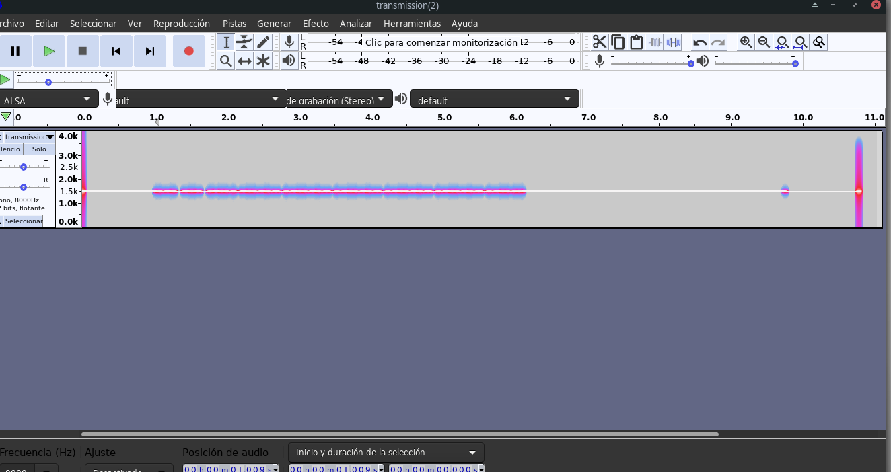
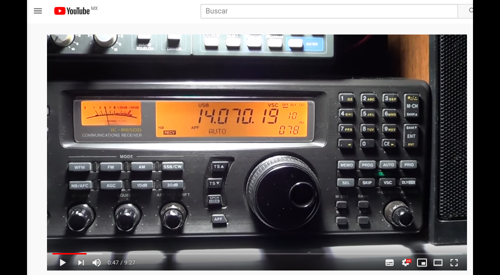

# PSK

## Descripción del reto

```
My friend sent my yet another mysterious recording...
He told me he was inspired by PicoCTF 2019 and made his own transmissions. I've looked at it, and it seems to be really compact and efficient.
Only 31 bps!!
See if you can decode what he sent to me. It's in actf{} format
```

## Solución

En este reto nos daban un archivo llamado transmission.wav, además, 
nos dan una pista muy importante y es que este reto fue inspirado por otro
del evento PicoCTF del año 2019, mismo en el que he participado así que ya 
sabía a qué reto se refería como referencia.



Lo primero que quise intentar fue abrir el archivo con audacity para ver su
espectograma esperando encontrar algo interesante pero este no fue el caso.


Después intenté abrir el archivo con QSSTV, un software que permite generar imagenes
a través de un archivo de audio ya que el reto de PicoCTF al que se hacía referencia
era uno donde a través de un archivo de audio se mandaba un mensaje a la luna
donde los astronautas generaban una imagen a través de este programa, sin embargo,
tampoco logré obtener ningún resultado pese a que jugué con las diferentes frecuencias.


En este punto ya estaba a nada de rendirme por lo complicado que estaba resultando el reto,
aún así, volví a intentar analizar el archivo con todas las herramientas que tengo esperando encontrar
algo de más utilidad, y así fue como con la herramienta exiftool la cual me brinda los metadatos del archivo
me topé con algo bastante interesante que me ayudaría bastante, un comentario (los cuales son raros de encontrar)
estaba dentro de los metadatos del archivo y decía: "BPSK31 fre=1.941".




Investigué bastante y se trataba de una señal digital que podía ser decodificada.
A partir de aquí busqué diferentes herramientas hasta que me topé con LFDIGI,
un software que permite utilizar la tarjeta de sonido de una computadora como un
módem de datos bidireccional.


Aquí fue cuando el comentario encontrado en los metadatos fue de mucha utilidad
pues bastó con configurar el software con dicha frecuencia para poder decodificar
el mensaje obteniendo así la flag.


