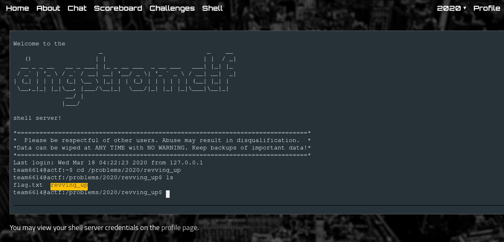

# Revving Up

## Descripción del reto

```
Clam wrote a program for his school's cybersecurity club's first rev lecture!
Can you get it to give you the flag? 
You can find it at /problems/2020/revving_up on the shell server, 
which you can access via the "shell" link at the top of the site.
```

## Solución

Este es uno de los primeros retos de reversa que he resuelto, y el hecho de que logré resolverlo
no es otro más que el de que era bastante sencillo.
Una vez que nos conectamos a la shell y navegamos a la ruta de la carpeta del reto
nos topamos con dos archivos.




Lo primero que intenté fue traer el contenido dentro de flag.txt, pero como era de esperarse
no tenía los permisos para extrar su contenido.


Después utilicé el comando strings nuevamente para traer el contenido dentro de revving_up el cual
era un binario ejecutable de linux.
En este caso se mostraba un historial previo de otro usuario ejecutando el archivo donde se indicaban los pasos
a seguir para obtener la flag, así que después de seguir los pasos obtuve la flag.


