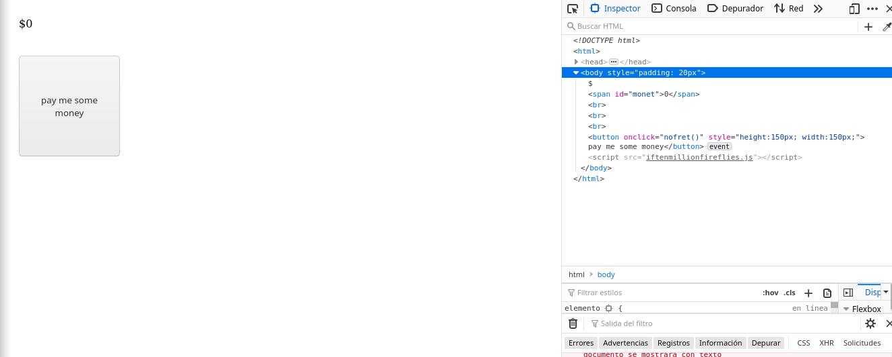
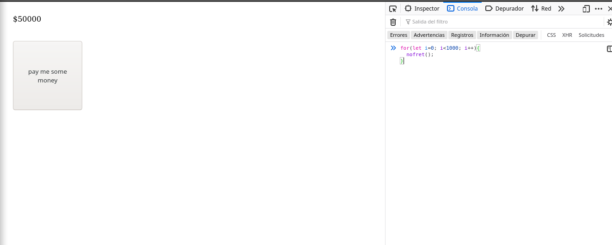
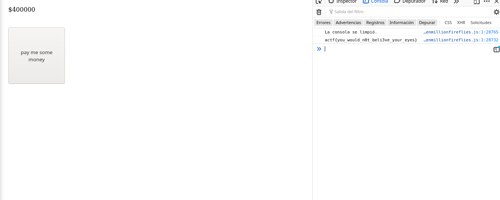

# Consolation

## Descripción del reto

```
I've been feeling down lately... Cheer me up!
```

## Solución



Como siempre menciono en los retos web, lo primero que se debe de hacer
es inspeccionar la página para ver el código.



De esta forma encontramos algo interesante, un script ofuscado llamado iftenmilionfireflies,
en este caso decidí no seguir las instrucciones del script y dejarme llevar más por mi intuición.



Así que hice un ciclo para ejecutar muchas veces el botón de "pay me some money" para darle más dinero, y en ciertas
iteraciones se imprimía la flag que era borrada más tarde.


