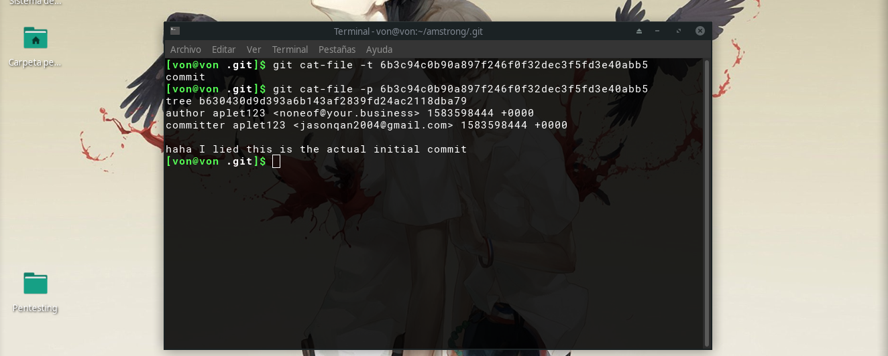

# Git Good

## Descripción del reto

```
Did you know that angstrom has a git repo for all the challenges? 
 noticed that clam committed a very work in progress challenge so I thought it was worth sharing.
```

## Solución


Por suerte en estos últimos días me había topado con retos similares a este así que resultó bastante fácil resolverlo.
De entrada sabemos que utilizaron Git en este proyecto y por lo que podremos traer información mediante la siguiente dirección https://gitgood.2020.chall.actf.co/.git/HEAD
así que aquí es donde empieza lo interesante, por cierto, vale la pena aclarar que si quieres aprender la estructura interna de Git crea un repositorio nuevo
y navega a través de la carpeta oculta .git para que entiendas mejor la estructura de esta y así puedas explotar más este tipo de retos.


En este punto decidí traerme la información del archivo ubicado en la carpeta .git/logs/HEAD en donde se mostrará el historial de commits.


A partir de aquí empezaremos a reconstruir todo el proyecto de manera manual, para esto habrá que crear un repositorio nuevo y vacío e iremos descargando
los respectivos archivos del proyecto del servidor para simular que es el mismo proyecto.

No entraré en muchos detalles pero sí mencionare que por ejemplo en la imagen anterior aparecen valores como el siguiente: 6b3c94c0b90a897f246f0f32dec3f5fd3e40abb5
El cual es un SHA1 donde se almacena la información con los respectivos cambios en dicho commit pues así funciona Git internamente.
La información de dicho SHA1 siempre se ubica en la siguiente dirección: .git/objects/ PRIMEROSDOSCARACTERESDELSHA / RESTODELSHA
por ejemplo: .git/objects/6b/3c94c0b90a897f246f0f32dec3f5fd3e40abb5


Una vez habiendo explicado esto, lo que se tendrá que hacer es lo siguiente:
1.- Crear un repositorio nuevo de Git.
2.- Ubicar cada SHA1 posible empezando por los que aparecen en la imagen anterior obtenidas de la ruta .git/logs/HEAD
3.- Descargar cada SHA1 creando la ruta de dicho SHA1 con el ejemplo anterior.
4.- Cambiar el nombre del SHA1 completo quitando los dos primeros caracteres y creando una carpeta dentro de .git/objects/ con los dos primeros caracteres que se le quitó de nombre al SHA1.
5.- Mover el SHA1 que ya no tiene los primeros dos caracteres a la carpeta que acabas de crear previamente.
6.- Utilizar el comando git cat-file -t HASH1COMPLETO en la carpeta raíz.
7.- Utilizar el comando git cat-file -p HAS1COMPLETO en la carpeta raíz.



Ejemplo del punto 6 y 7: git cat-file -t 6b3c94c0b90a897f246f0f32dec3f5fd3e40abb5 aún cuando la ruta de ubicación es .git/objects/6b/3c94c0b90a897f246f0f32dec3f5fd3e40abb5
Es importante recordar que se llamará al HASH1 COMPLETO, aún cuando en la ruta .git/objects/6b/3c94c0b90a897f246f0f32dec3f5fd3e40abb5 el HASH1 ahora se llama 3c94c0b90a897f246f0f32dec3f5fd3e40abb5 por haberle quitado los primeros dos caracteres.
De esta forma traeremos el contenido de dicho commit, y habrá que repetir del paso 2 al 7 cada vez que intentemos extraer la información de un commit.
Esto nos llevará a repetir este proceso varias veces hasta encontrar la flag en un archivo.


