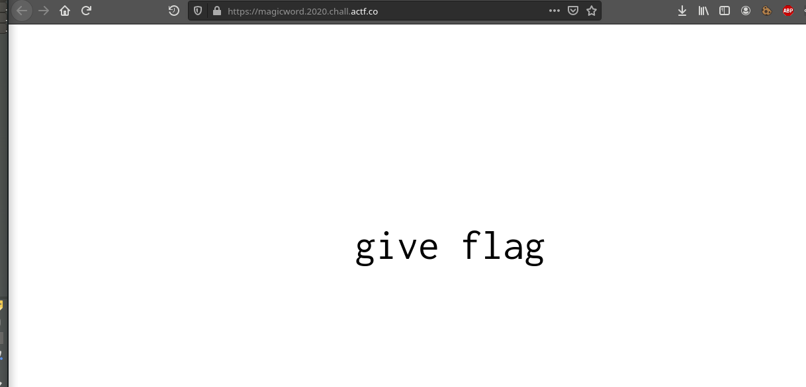

# The Magic Word

## Descripción del reto

```
Ask and you shall receive...that is as long as you use the magic word.
```

## Solución



Como siempre menciono en los retos web, lo primero que se debe de hacer
es inspeccionar la página para ver el código.


De esta forma encontramos algo interesante, un script bastante sencillo
en el cual si el elemento con id "magic" tiene como texto "please give flag"
ejecutará una petición fetch al servidor.


Bastó con utilizar ese id e innerHTML para cambiar el mensaje por "please give flag"
para que se ejecutara dicha petición y así se obtuvo la flag.


