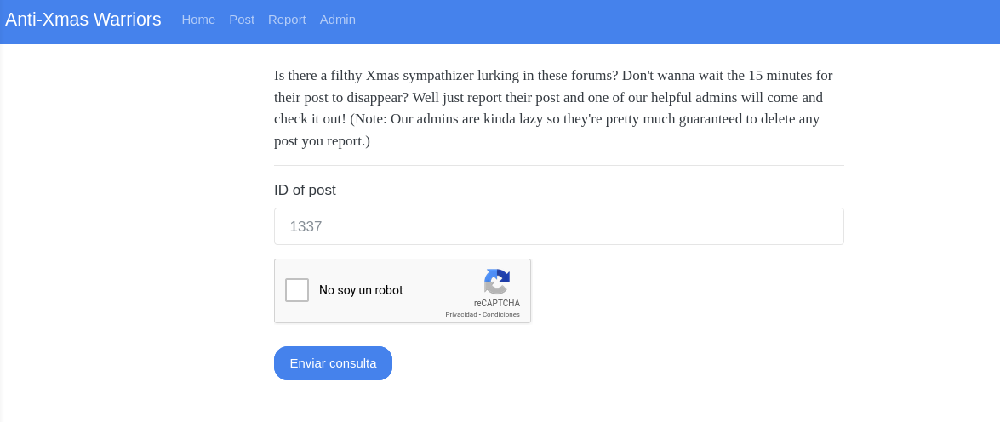
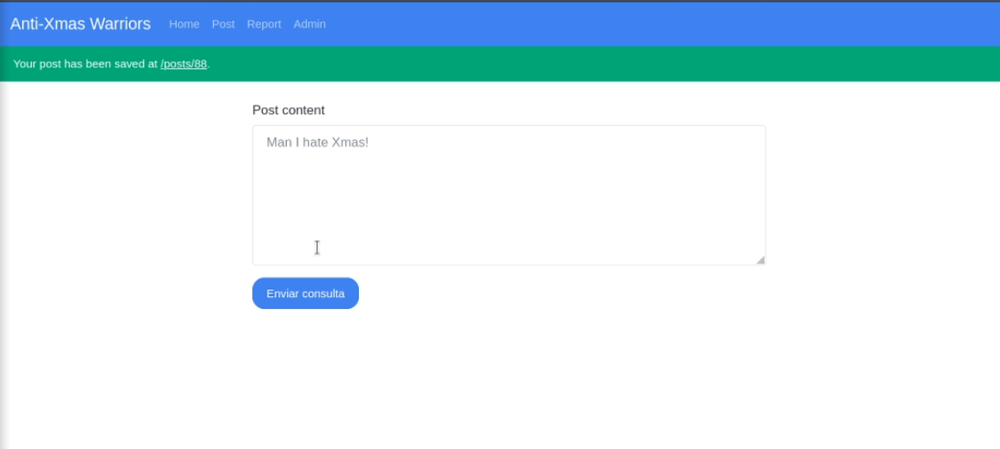
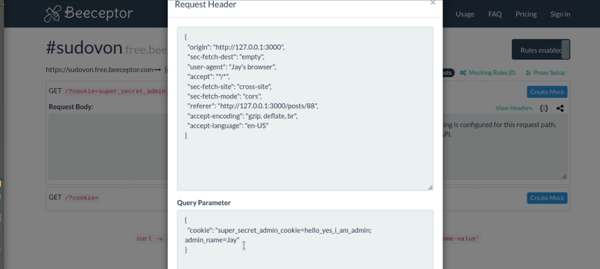

# Xmas Still Stands

## Descripción del reto

```
You remember when I said I dropped clam's tables? Well that was on Xmas day. 
And because I ruined his Xmas, he created the Anti Xmas Warriors to try to ruin everybody's Xmas. 
Despite his best efforts, Xmas Still Stands. But, he did manage to get a flag and put it on his site. Can you get it?
```

## Solución


En este reto se nos daba acceso a un sitio web con tres páginas importantes.

La primera es una página donde podías realizar un POST y este se guardararía para que puedas acceder mediante su ID.



La segunda página te permitía reportar un POST para que el administrador lo borre, y es importante recalcar que el administrador verá el POST antes de eliminarlo.


La tercera y útlima página te indicaba que mientras no tengas la cookie secreta que verifique que eres el administrador no podrás ver el contenido de la página.

Una vez aclarado todo esto, está de más decir que se trata de un reto de XSS en donde deberemos obtener las cookies del administrador para robarle
su sesión y hacernos pasar por él. 


En este reto decidí utilizar la página free beceptor para guardar las cookies que llegaban como parámetro.


Este fue el payload que creé para obtener las cookies de la persona que entre a dicha página, mismas que serán enviadas mediante una petición FETCH a la página beeceptor
que mencioné anteriormente donde estas quedarían guardadas.
Esta es la parte más importante pues el plan es que al inyectar este código HTML con un source inválido entonces el onerror se activará y realizará la petición
fetch en cuanto la persona abra la página, en este caso el administrador.




Una vez enviado el payload accedí a la página para comprobar que todo estaba funcionando y dicha petición llegó a beeceptor con éxito.
Sólo era cuestión de pedirle al administrador que mediante el ID entrara al POST y lo borrara robando así sus cookies también.


De esta forma obtuve las cookies del administrador y me hice pasar por él al robarle la sesión.




Una vez obtenidas sus cookies, sólo las añadí al navegador y abrí la página del administrador obteniendo así la flag.
