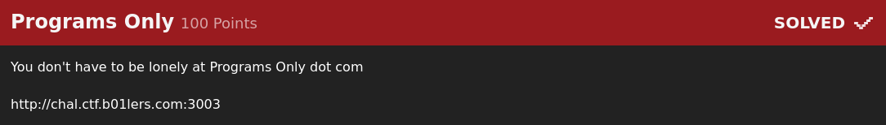
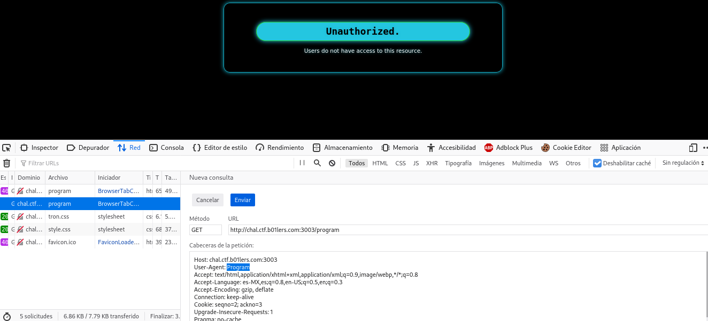
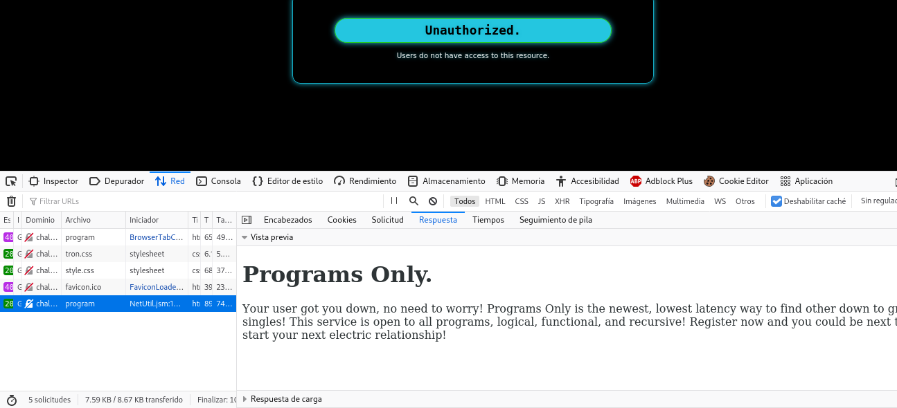
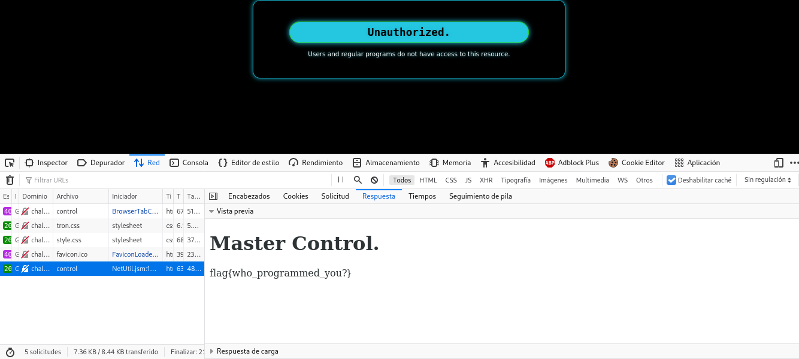

# Programs Only

En este reto nos encontramos con una página web con información de una película.
De entrada vemos que se muestra nuestro user-agent en la parte superior así que es una gran pista para lo que se
vendrá más adelante.

Lo primero que hice fue encontrar la ruta importante de la página para ver qué podía obtener ahí.

Sin embargo, una vez dentro de la ruta no tenía permisos para ver el contenido así que teniendo en cuenta
el tema del user-agent me fui al único lugar que conozco donde esto tiene una relación... a la ruta
de robots.txt la cual ayuda para saber qué se indexará.

A partir de estue punto fue bastante sencillo, sólo entré a las dos rutas indicadas en robots.txt
con los user-agent dados para obtener la flag.

