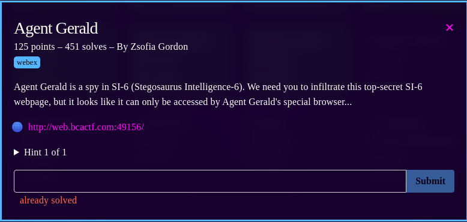
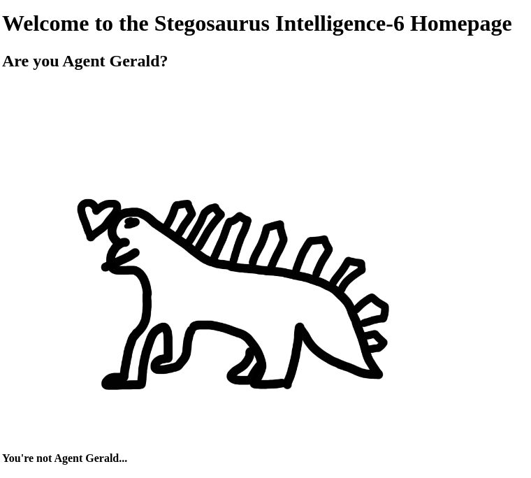
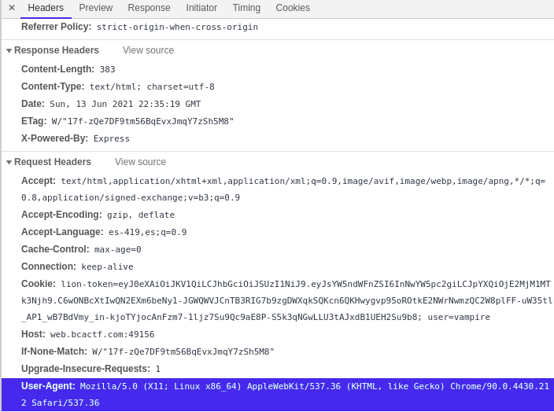
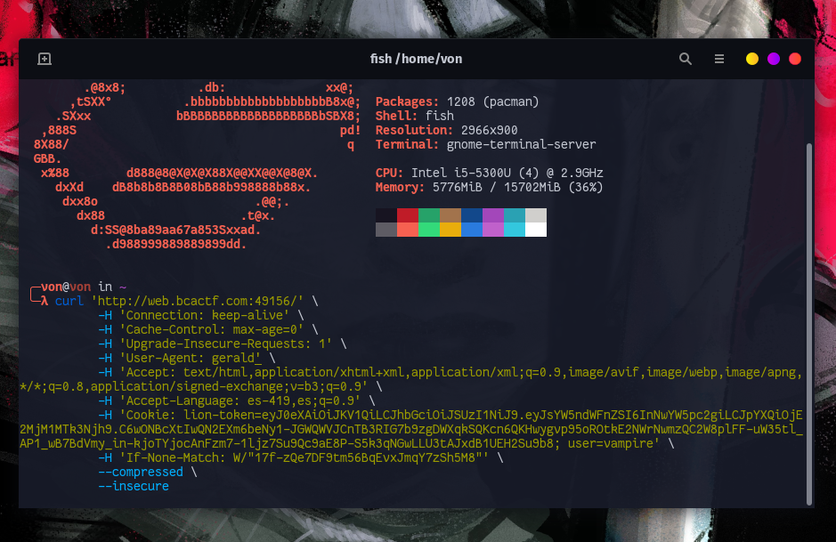

# Agent Gerald

## Description

Classic challenge where the user-agent is used as an authentication method when it must be used as a debugging tool.

I just changed the user-agent request header to gerald and i got the flag.

