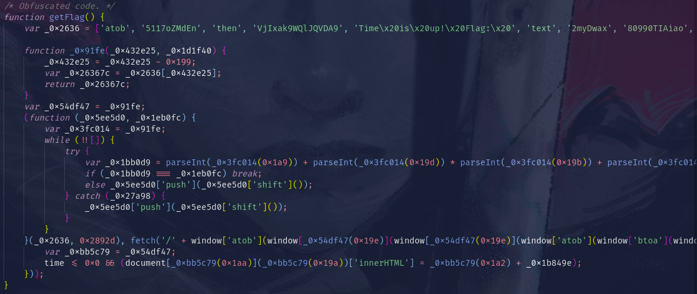
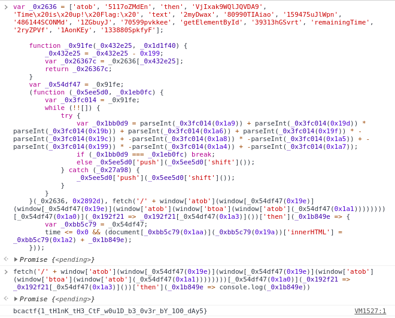

# Countdown Timer

## Description

In this challenge there was a web page where you could set the number of days of a counter.

The first step to solve this challenge was to inspect the code and search how the counter works.

I decided to comment the code just in case that you want to know how it works.

What caught my attention was the getFlag function, specifically the http request (fetch) in the obfuscated code. So i executed the code in the console and just printed what the promise returned. That's how i got the flag.

