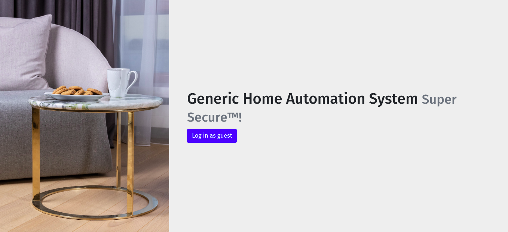

# Home Automation

## Description

In this challenge there was a web page where you could turn off the lights, but you must be an admin.

In this case we were a "vampire" so i guessed that this must be stored in the cookies.
Just looking the request headers we can see that we sent "user=vampire" in the cookies so
i just needed to change this value to "admin", that's how i got the flag.

