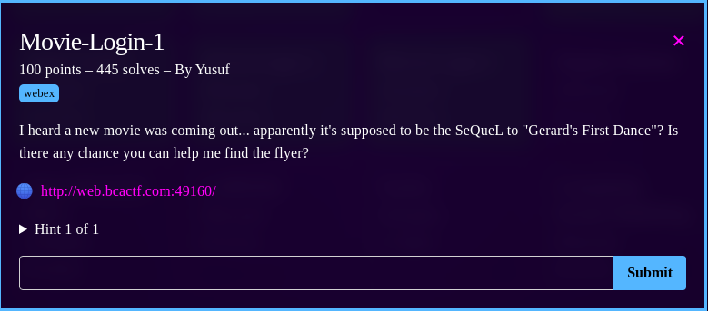
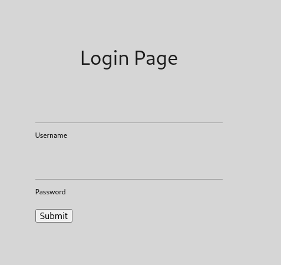
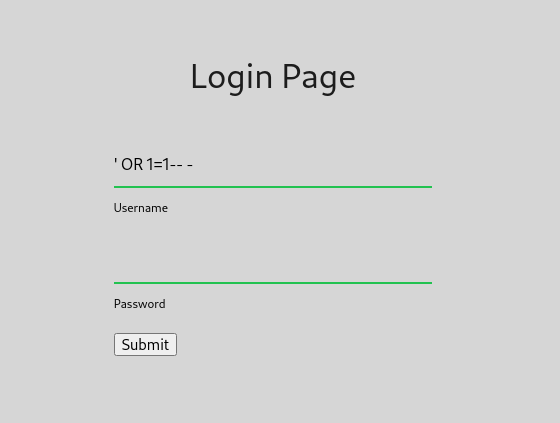
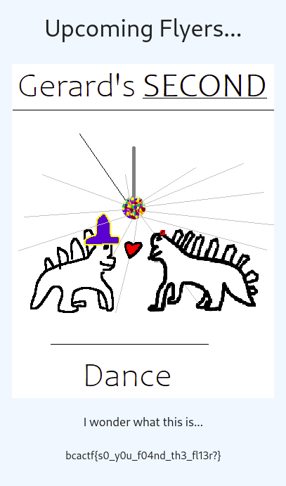

# Home Automation

## Description

In this challenge there was a web page where you need to login but you don't have the credentials.

This seems to be the classic sql injection challenge so i tried the most common sql injection and it worked.

That's how i got the flag.