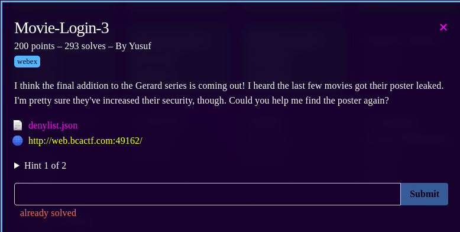
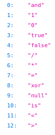
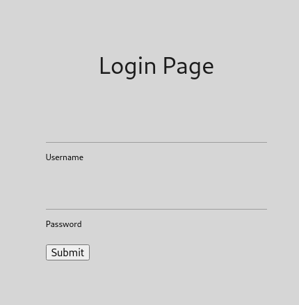
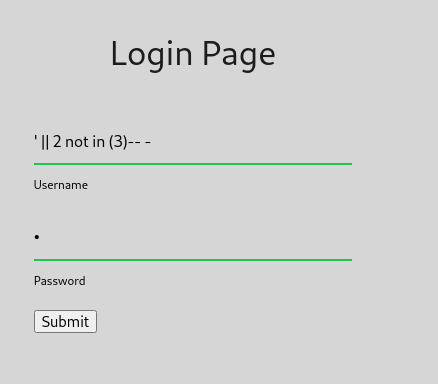
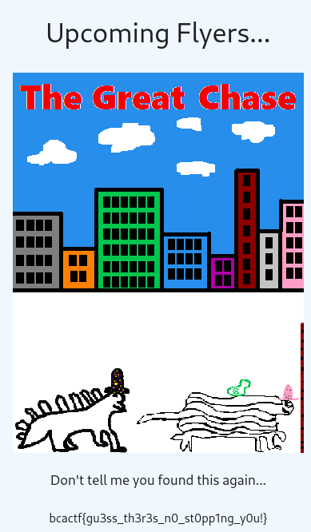

# Movie Login 3

## Description

In this challenge there was a web page where you need to login but you don't have the credentials.

This is a classic sql injection challenge, the same as the movie-login-1 and movie-login-2 with the differente that there is a file called "denylist.json" that as you could guess it's an array with banned words but has more banned words than the movie-login-2 challenge.

I just tried another way to do a sql injection without using these banned words and it worked. 
Even if "OR" was banned i just used "||" and abused from the NOT IN expressions. 
That's how i got the flag.

