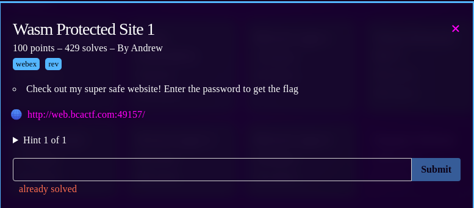
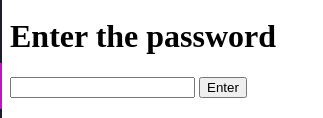
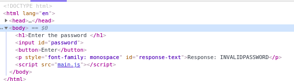
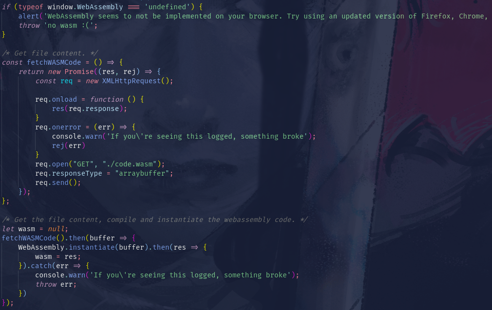
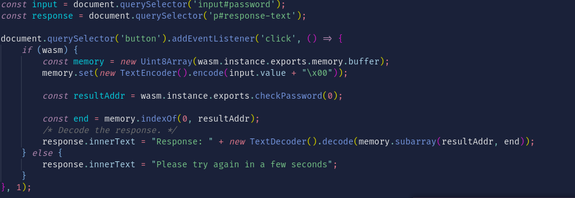
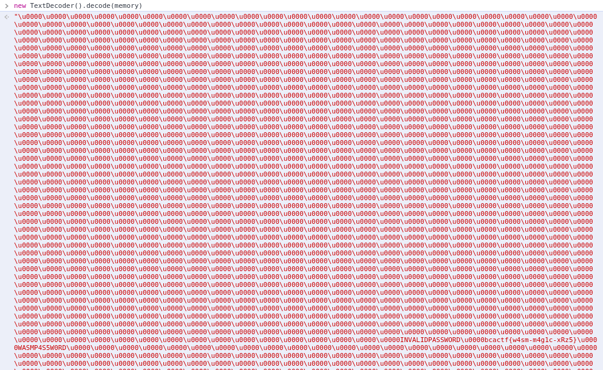
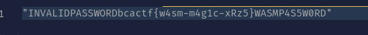
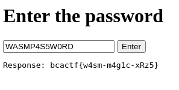
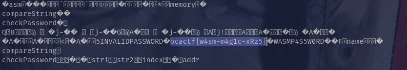

# Wasm Protected Site 1

## Description

In this challenge there was a web page where you need to put the correct password.

The first step to solve this challenge was to inspect the code and check how the script works.

I added comments to understand better the code.

What i did was to decode the binary, that's how i could see the flag but
if you want to know why did this happend was because the strings were hardcoded in the binary.
That's why in some forensic challenges you can get the flag/password if the flag/password was hardcoded.
In this case i decoded the binary and then just removed what i didn't need.

The other way to solve this challenge was to just download the binary and use the strings command or open the binary in the text editor.

That's how i got the flag.