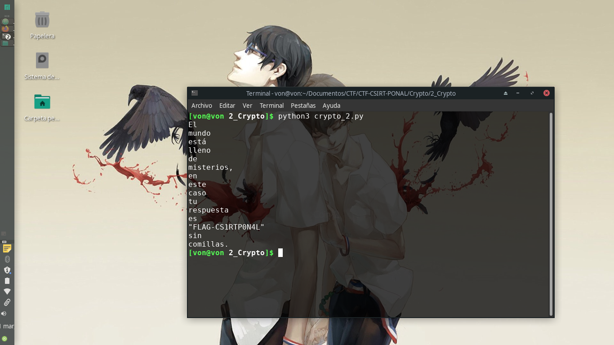

# 2_Crypto

## Descripción del reto

```
069108 109117110100111 101115116225 108108101110111 100101 109105115116101114105111115044 101110 101115116101 099097115111 116117 114101115112117101115116097 101115 034070076065071045067083049082084080048078052076034 115105110 099111109105108108097115046 
```

## Solución

En este reto nos daban un mensaje cifrado sin ningún tipo de descripción así que estuve investigando hasta que me topé con una página que mostraba la función CHAR() de MySQL donde recibía como parámetros números enteros y esta retornaba el valor acorde de la tabla ASCII ignorando valores nulos. Por lo que decidí elaborar un script en python que resolviera el reto.



