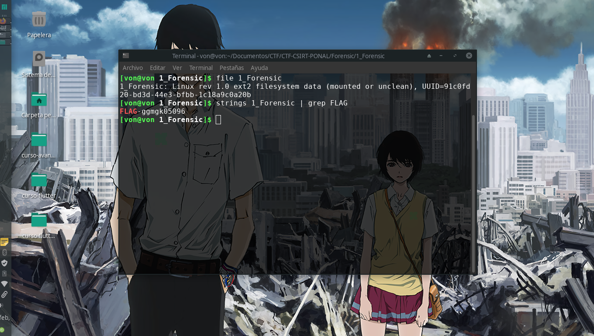

# 1_Forensic

## Descripción del reto

```
Pastilla roja o azul....Encuentra la forma de ingresar a la matrix... 
```

## Solución

En este reto nos daban un archivo llamado 1_Forensic.

Una vez que analicé el tipo de archivo noté que podía montarlo y ver lo que alguna vez contuvo.

Después de investigar cada uno de los archivos no pude encontrar la flag aún cuando encontré una imagen que hacía
referencia a una matrix tal como el reto indicaba, sin embargo,
decidí volver a descargar el archivo y realizar busquedas en el archivo principal sin montar esperando encontrar algo de utilidad.
De esta forma me di cuenta que nunca fue necesario montar el archivo, la Flag se encontraba en este desde un principio.


