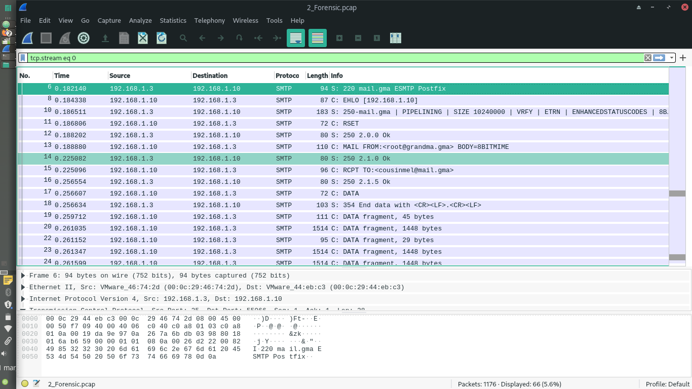
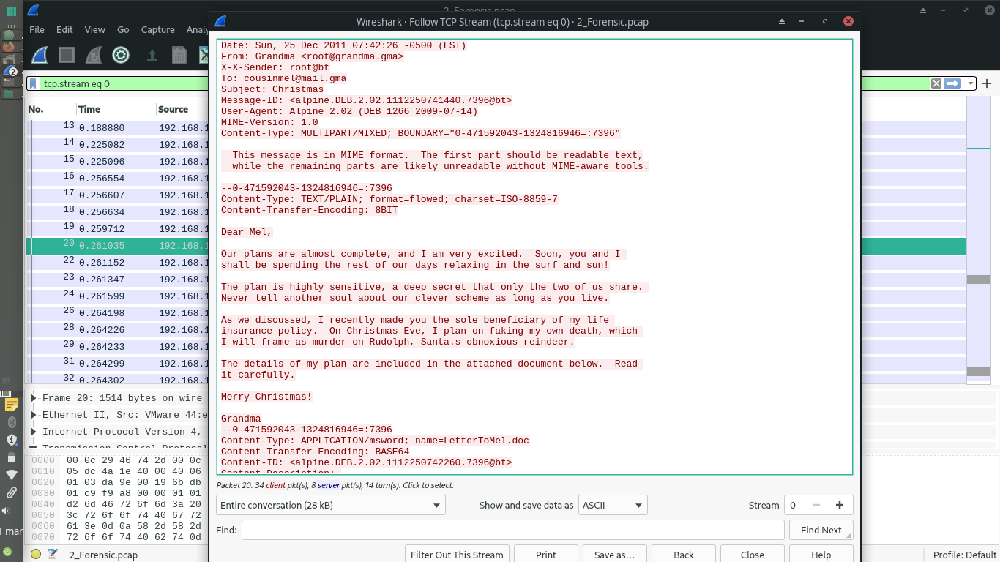

# 2_Forensic

## Descripción del reto

```
Hemos interceptado informacion que podria revelar el hotel donde se encuentra una fugitiva...
pero nuestros investigadores no han logrado encontrarla... 
```

## Solución

Este ha sido mi reto favorito del CTF por lo divertido que fue.
En este reto nos daban un archivo llamado 2_Forensic.pcap
De entrada se sabe que nuestra herramienta por defecto será wireshark para poder analizar los paquetes del tráfico en la red.



Una vez dentro, empecé a buscar información que me fuera de utilidad.
Me topé con varios protocolos, entre ellos TCP, UDP, FTP, SMTP, HTTP, etc.
Pero el que más me llamó la atención fue SMTP pues es un protocolo para la transferencia de correo, así que me enfoqué en él por la descripción del reto.
Por lo visto se había interceptado una conversación donde se revelaba que una persona fingiría su muerto para luego cobrar una fortuna y poder pasarla a su hijo. Holy fk, todos unos detectives LMAO.



A partir de ahí lo único que hice fue seguir la conversación, misma que viajaba en texto plano, hasta que me topé con que habían unas partes del mensaje que habían sido codificadas en base64.


Por lo que sólo las decodifiqué y obtuve así el mensaje donde se revelaba la ubicación de esta persona.


