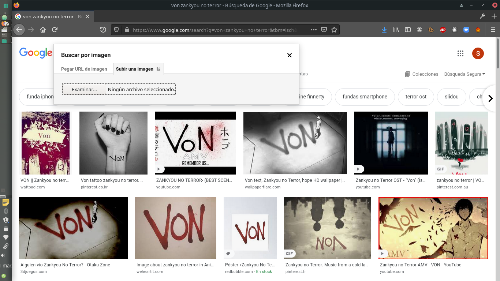
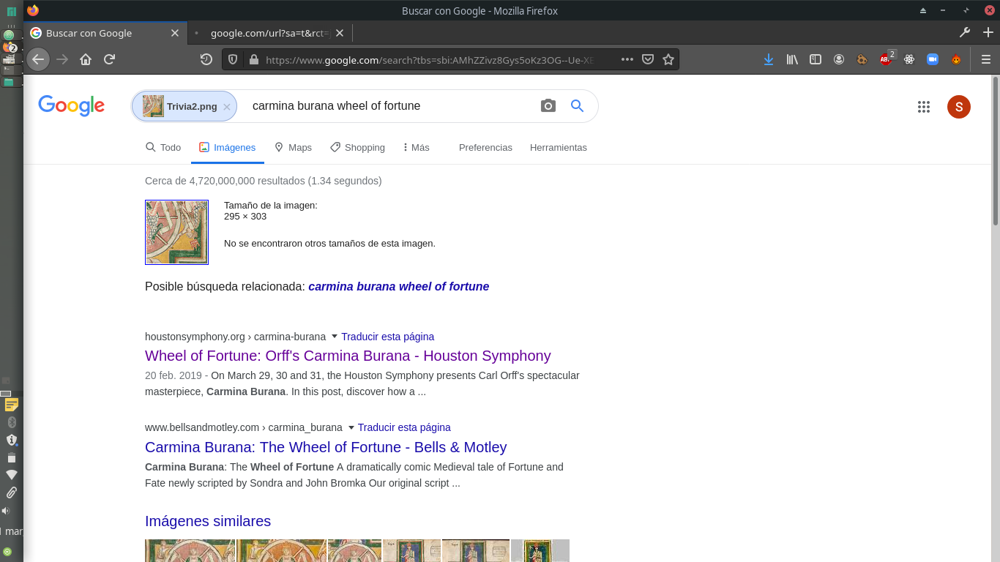

# 2_Trivia

## Descripción del reto

```
¿Podrás descubrir el poema que representa la imagen? 
```

## Solución

En este reto nos daban una parte de lo que sería una imagen completa, por lo que había que descubrir el poema que representaba la imagen completa.

Lo primero que hice fue descargar la imagen y entrar a google imágenes para poder subirla y que este me indique donde encontrar más imágenes relacionadas o similares.



De esta forma encontré el nombre de la imagen: Carmina Burana: The Wheel of Fortune.
Por lo que sería más fácil descubrir el poema que representaba la imagen.



Después de investigar encontré el nombre del poema obteniendo así la flag.


