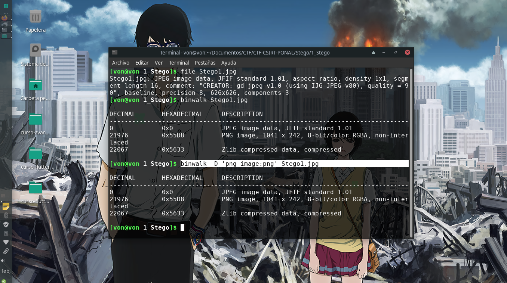

# 1_Stego

## Descripción del reto

```
 Han dicho que este amigo es infinito, pero en este caso no 
```

## Solución

En este reto nos han dado una imagen, misma que contiene a PI.
Lo primero que hice fue analizar el archivo para comprobar que sí se trataba de una imagen.
Después comprobé si tenía archivos dentro de la imagen, algo muy común en este tipo de retos, y efectivamente, tenía varios archivos ocultos.



Procedí a utilizar binwalk y saqué la imagen .png de la imagen original.
Esta contenía nuevamente a PI pero hasta cierto rango, por lo que supuse que sería la flag así que la inserté para comprobarlo 
y efectivamente era esta.


