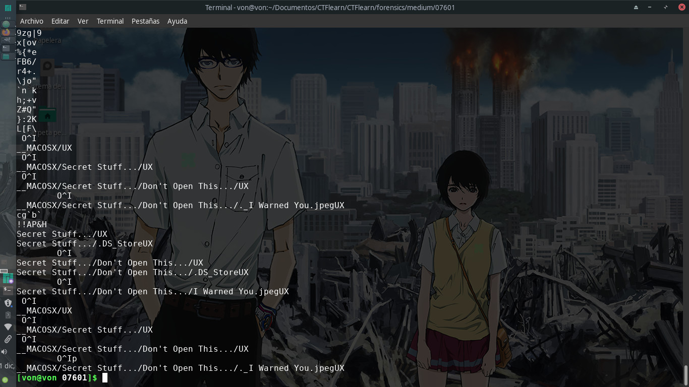
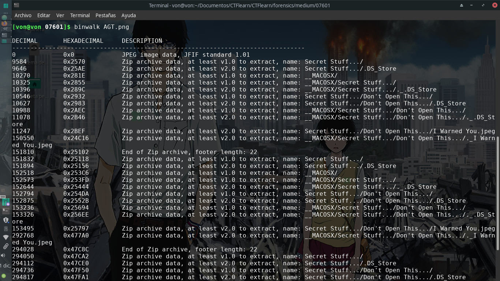

# 07601

## 60 points

### Forensics - Medium

Descripción del reto:

```
I think I lost my flag in there. Hopefully, it won't get attacked...
```

### URL del archivo:

```
https://mega.nz/#!CXYXBQAK!6eLJSXvAfGnemqWpNbLQtOHBvtkCzA7-zycVjhHPYQQ
```

### Solución del reto:
Este es uno de los retos que más pereza me ha dado resolver, quizá porque no tengo mucha experiencia en la categoría y quizá hay una forma más sencilla de resolverlo.




Lo primero fue utilizar strings en la imagen, eso me permitió saber que dentro de la imagen habían rutas y archivos sospechosos por lo que utilicé binwalk para poder acceder a ellos.




Lo que sigue fue cuestión de utilizar binwalk y strings en cada imagen de cada ruta hasta
que en una de ellas encontré la flag en la parte inferior al utilizar strings nuevamente.

No explicaré más detalles sobre strings ni binwalk pues al haber llegado a este punto ya deberás de  tener conocimientos previos de ellos.
