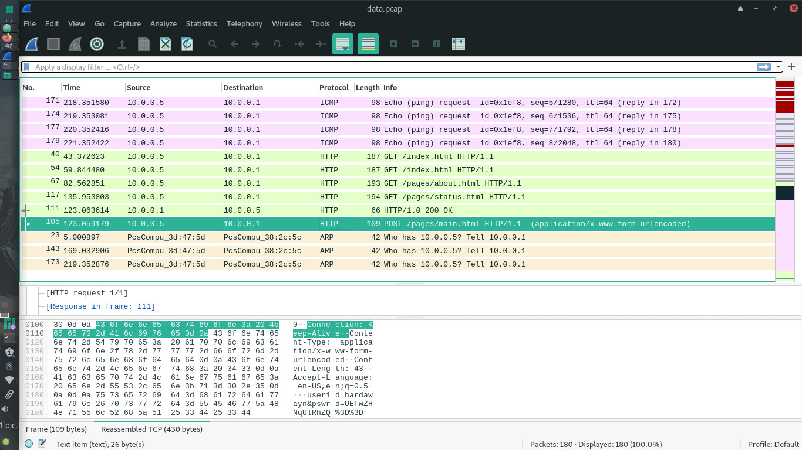
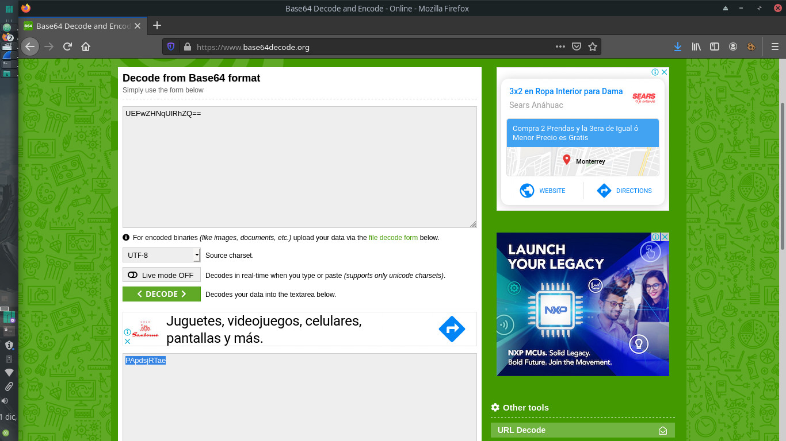

# Digital Camouflage

## 40 points

### Forensics - Medium

Descripción del reto:

```
We need to gain access to some routers. Let's try and see if we can find the password in the captured network data.
Hint 1: It looks like someone logged in with their password earlier. Where would log in data be located in a network capture?
Hint 2: If you think you found the flag, but it doesn't work, consider that the data may be encrypted.
Credit: picoCTF 2017
```

### URL del archivo:

```
https://mega.nz/#!XDBDRAQD!4jRcJvAhMkaVaZCOT3z3zkyHre2KHfmkbCN5lYpiEoY
```

### Solución del reto:



Otro reto bastante interesante y divertido en el que tendremos que utilizar WireShark.
Esta vez el tráfico capturado fue menor por lo que encontrar algo extraño fue más sencillo.


Me basé en que había una sola petición de tipo POST, misma que enviaba dos parámetros, siendo el primero el usuario y el segundo la contraseña sólo que esta estaba encriptada en base64 así que bastará con utilizar un desencriptador de base64 ya sea online o el que yo programé anteriormente.


