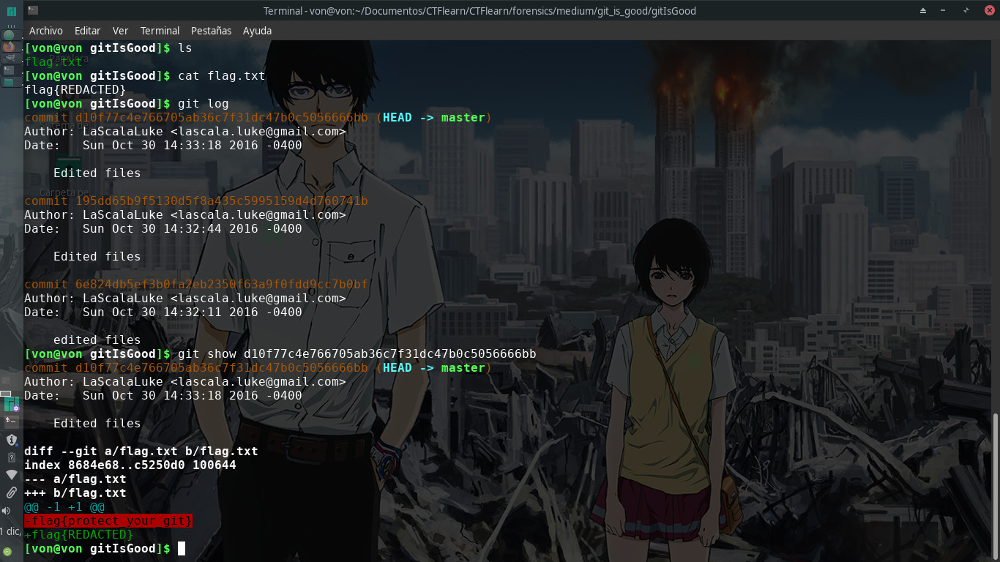

# Git Is Good

## 50 points

### Forensics - Medium

Descripción del reto:

```
The flag used to be there. But then I redacted it. Good Luck.
```

### URL del archivo:

```
https://mega.nz/#!3CwDFZpJ!Jjr55hfJQJ5-jspnyrnVtqBkMHGJrd6Nn_QqM7iXEuc
```

### Solución del reto:
Este es uno de los retos más sencillos de todos si es que ya has utilizado el sistema de control de versiones GIT con anterioridad.


Basta con descomprimir el archivo .zip que nos dan y acceder al archivo flag.txt que tiene dentro.
Claramente esa no es la flag, pero una vez viendo los commits que se han hecho podemos notar que la flag fue cambiada en una versión anterior.

Al acceder al último commit podremos obtener la verdadera flag.



