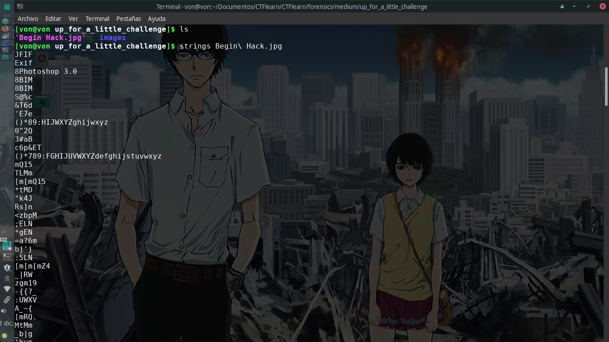
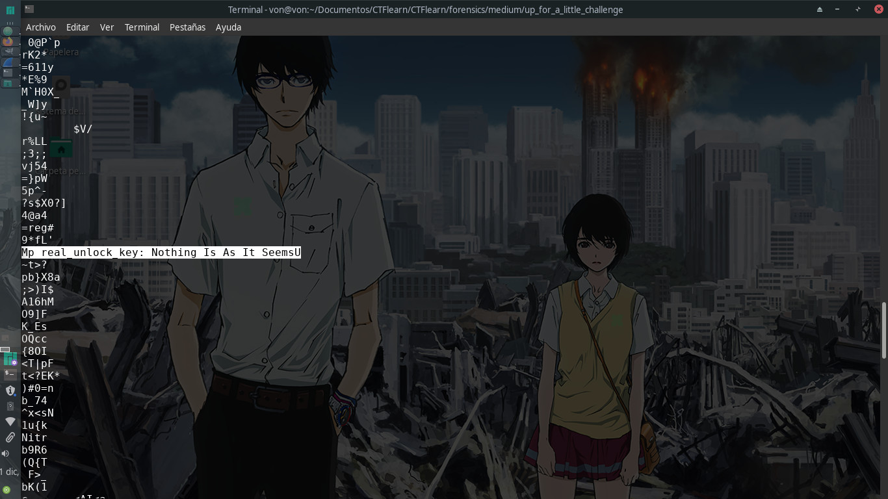
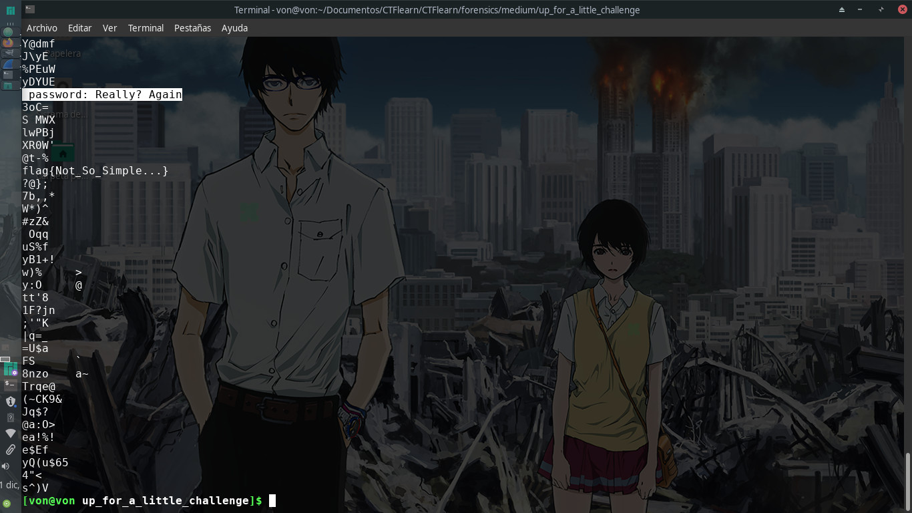
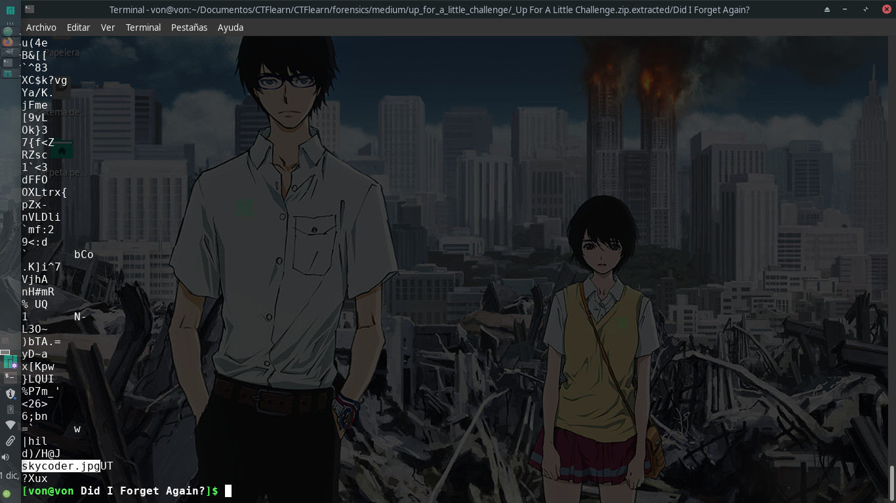
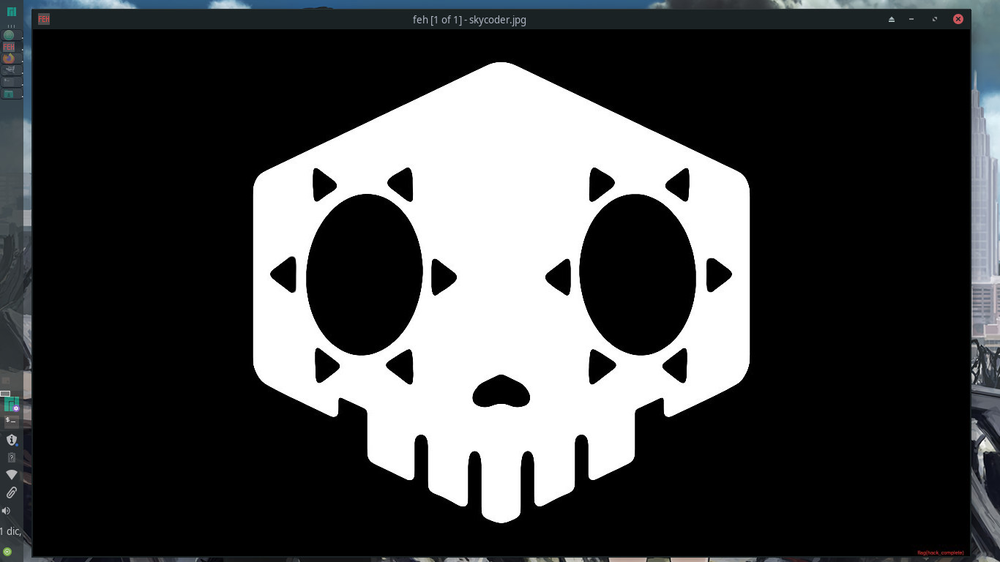
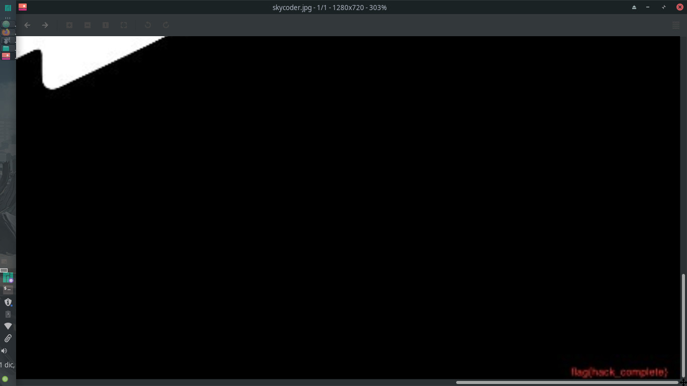

# Up For A Little Challenge?

## 60 points

### Forensics - Medium

Descripción del reto:

```
You Know What To Do ...
```

### URL del archivo:

```
https://mega.nz/#!LoABFK5K!0sEKbsU3sBUG8zWxpBfD1bQx_JY_MuYEWQvLrFIqWZ0
```

### Solución del reto:
Este reto me gustó bastante, aún cuando la parte final del reto me desagradó pues para alguien ciego como yo pudo resultar en tragedia.



Nuevamente, se nos brinda una imagen por lo que el primer paso que realicé fue utilizar strings obteniendo cosas bastante interesantes:
1.- Un link de mega.
2.- Dos posibles contraseñas que en ese momento no sabía para que me servirían pero siempre vale la pena tenerlas a la mano.






Después de descargar el archivo del link de mega que estaba oculto en la imagen decidí utilizar binwalk para encontrar cualquier archivo oculto dentro de él.




Luego utilicé el comando ls -la y me encontré con algunos archivos ocultos en la carpeta, uno de ellos era una imagen así que decidí utilizar strings y noté que hacía referencia a otra imagen, fue cuestión de volver a utilizar binwalk sólo que ahora en esa imagen.


Descomprimí el archivo que estaba dentro de esta imagen pero para acceder a la imagen referenciada en strings tenía que ingresar una contraseña, misma que estaría al inicio del reto cuando mencioné que valía la pena guardar las dos posibles contraseñas que en su momento desconocía para que servirían.



Al final logré abrir la imagen pero no veía la flag por ningún lado, y he aquí por qué odié en parte el final del reto... la FLAG sí estaba pero a penas y se veía, se localizaba en la esquina inferior derecha de la imagen.


