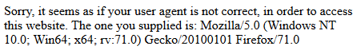
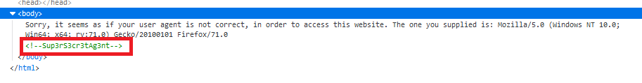
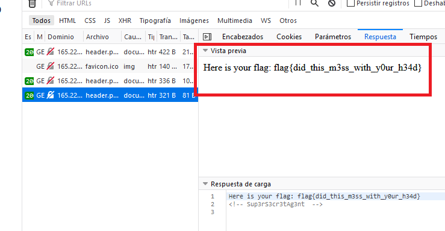

# Don't Bump Your Head(er)

## 70 points

### Web - Hard

Descripción del reto:

```
Try to bypass my security measure on this site!
```

### URL del reto:

```
http://165.227.106.113/header.php
```

### Solución del reto:

Al entrar al sitio nos muestra un mensaje de que nuestro user agent no es el correcto para ingresar al sitio.



Por lo tanto, procederemos a inspeccionar la página para encontrar información que sea de utilidad, en este caso nos brindan el user agent que nos permitirá ingresar al sitio.



Iremos al apartado de red, recargaremos la página para obtener las peticiones y cambiaremos nuestro user agent por el que nos brinda la página. Esto se envía desde las cabeceras de la petición.


Al obtener la respuesta de la página, nos aparecerá un nuevo mensaje. Tenemos que venir de un sitio llamado:
"awesomesauce.com" por lo que enviaremos esto nuevamente en otra petición utilizando "Referer" la cual cumple con la condición que nos piden de venir de un sitio específico.


Y de esta forma obtenemos la FLAG.


