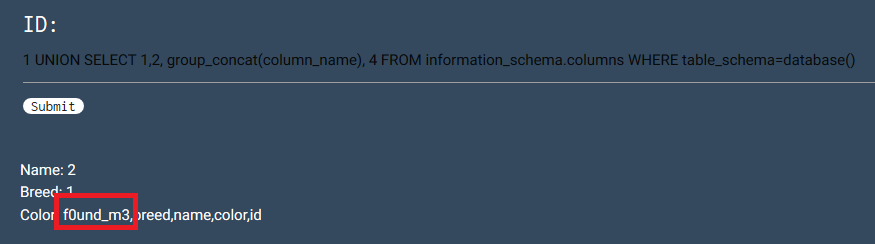
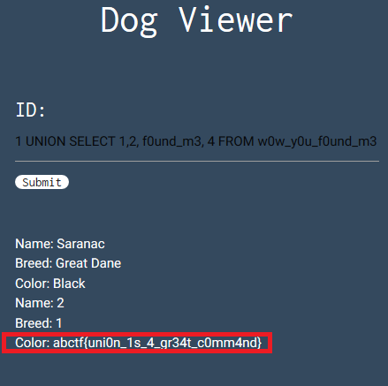

# Inj3ction Time

## 100 points

### Web - Hard

Descripción del reto:

```
I stumbled upon this website and I think they have the flag in their somewhere. UNION might be a helpful command.
```

### URL del reto:

```
http://web.ctflearn.com/web8/
```

### Solución del reto:

Para acortar las cosas, mencionaré que es fácil identificar que se trata de otro reto de inyección sql, y podemos
saberlo desde la descripción del reto donde nos dicen que "UNION" puede ser un comando útil.
De igual forma, puedes comprobar que se trata de un reto de inyección sql intentando con el clásico ' OR 1'=1--

Algo que te podría ser de mucha utilidad si deseas saber como resolver este reto por tu cuenta y que yo recordé al instante cuando lo vi, es la guía de portswigger, la empresa encargada de elaborar burpsuite, una herramienta bastante buena para
la seguridad informática, misma que debí utilizar para resolver los otros retos pero que al final decidí resolver desde el mismo navegador para agilizar las cosas.

Link para aprender más sobre las inyecciones sql: https://portswigger.net/web-security/sql-injection/
Esta misma página tiene categoría de inyecciones a ciegas (Blind sql injection) y de inyecciones de tipo UNION
la cuales estarán presentes en este reto.

Volviendo al reto...

Al entrar en la página veremos que debemos ingresar una ID para que nos muestre en pantalla los resultados.
En este caso ingresé 1 y nos arrojó lo siguiente:


Los pasos para realizar un ataque de tipo UNION inicia por conocer el número de columnas que regresa la columna.
Para saber esto basta con cumplir la consulta y agregar a la inyección "ORDER BY X" donde X es el número de columnas.
Empecé con 1, y terminé con 4 pues cuando ponemos 5 deja de regresarnos la consulta ya que esta retorna menos columnas.


Ahora que sabemos su número de columnas, necesitamos conocer las tablas que hay en la base de datos, por lo que
realizamos la siguiente inyección para que nos retorne las tablas que hay, obteniendo de esta manera la tabla que nos interesa, la del clásico formato: 3st0_3s_un4_p1st4.

Por cierto, si se ve más alargada la entrada de datos de la página es porque la modifiqué con las clases de CSS que tiene
ya que están utilizando materialize, todo esto para que se viera completa la inyección en la imagen.


Ahora que conocemos las tablas, necesitamos conocer sus columnas por lo que modificaremos un poco la inyección
para obtener sus columnas.
Es importante mencionar que utilizamos concat para que nos junte todos los resultados en la misma salida.



Ahora sólo bastará con reemplazar la columna y la tabla en la inyección para que nos retorne la FLAG.


