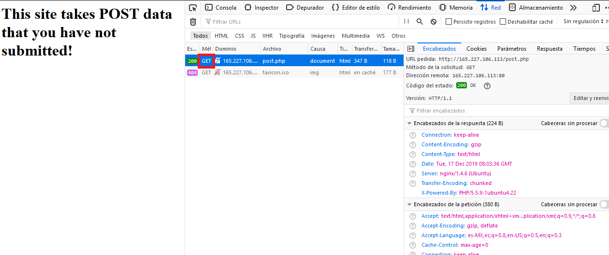
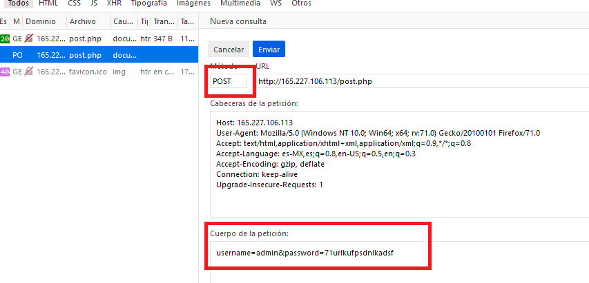

# POST Practice

## 40 points

### Web - Medium

Descripción del reto:

```
These website requires authentication, via POST. However, it seems as if someone has defaced our site.
Maybe these is still some way to authenticate?
```

### URL del reto:

```
http://165.227.106.113/post.php
```

### Solución del reto:

Al entrar al sitio nos indica que hay información mediante una petición POST que no ha sido enviada, pero como siempre menciono, lo que haremos antes de continuar es inspeccionar la página.


Aquí notamos que nos dan la información que no ha sido enviada mediante una petición POST.
Por lo que procederemos a revisar las peticiones de la página así que bastará con ir
al apartado de "Red" y recargar la página para mirar sus peticiones.


Se puede observar que la petición de la página está hecha mediante GET, y si sumamos que se nos había dicho que había información sin enviar, bastará con modificar la petición de GET a POST, y enviar
la información como parametros.





Una vez hecho esto, abrimos la página que nos ha regresado la petición modificada como respuesta y nos regresará la FLAG.


