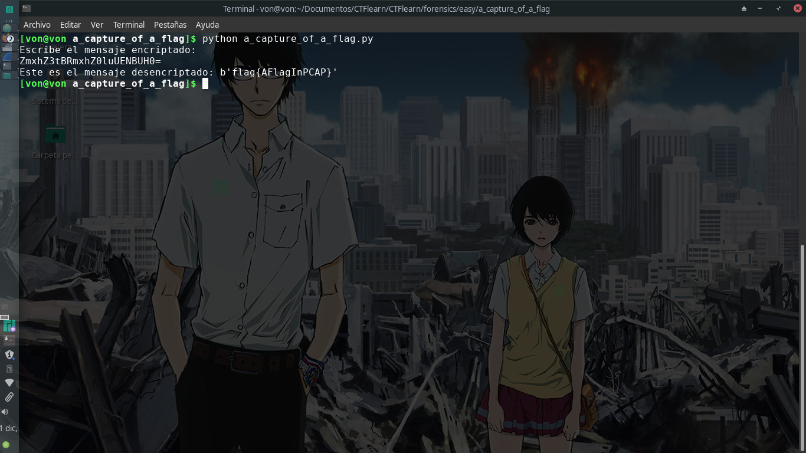
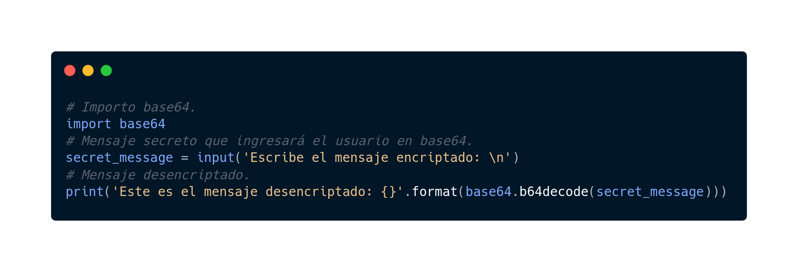

# A CAPture of a Flag

## 30 points

### Forensics - Easy

Descripción del reto:

```
This isn't what I had in mind, when I asked someone to capture a flag... can you help? You should check out WireShark.
```

### URL del archivo:

```
https://mega.nz/#!3WhAWKwR!1T9cw2srN2CeOQWeuCm0ZVXgwk-E2v-TrPsZ4HUQ_f4
```

### Solución del reto:
Es un buen reto introductorio para aprender a utilizar WireShark pues tanto el título como la descripción nos indican que utilizaremos WireShark. Aquí te dejaré una descripción breve del archivo que nos brindaron:
```
A file with the CAP file extension is most likely a Packet Capture file created by packet sniffing programs. This kind of CAP file holds raw data collected by the sniffing program so that it can be analyzed at a later time or with a different program.
```


Al abrir el archivo en WireShark vi un montón de peticiones pero como el reto era de dificultad sencilla, supuse que no tenía que ver todas las peticiones o tráfico sino filtrarlo y encontrar algo que pudiera ser más reconocido, y así fue como llegué a una petición encriptada en base64 la cual era una de las únicas dos peticiones GET en todo el tráfico recolectado, sin embargo, no opté por la otra pues era una petición a un recurso de carbon.js que no merecía importancia.


Una vez habiendo obtenido el link de la página a la que se hizo la petición decidí entrar pero no encontré la flag, una vez más pensé que al ser un reto de dificultad sencilla había algo que estaba dejando pasar, y ahí fue cuando pensé en la URL encriptada así elaboré un script para desencriptar el base64 en Python.



De esta manera obtuve la flag.



Sé que pude usar un desencriptador online pero la mejor manera de aprender es hacer las cosas por tu cuenta.

### Recordatorio:
El script original se encuentra en la carpeta, sin embargo, también dejaré la imagen del código en este archivo README.md
