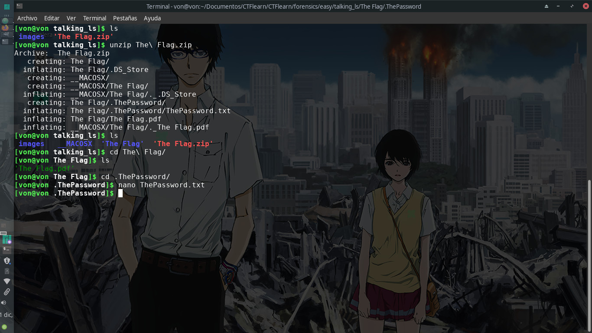
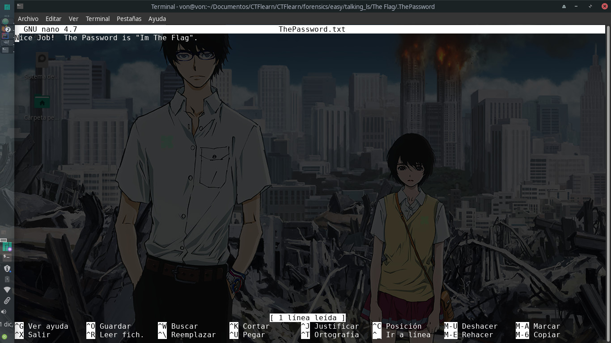
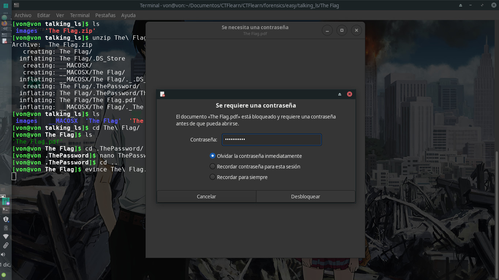

# Talking LS

## 30 points

### Forensics - Easy

Descripción del reto:

```
Just take the Ls. Check out this zip file and I be the flag will remain hidden.
```

### URL del archivo:

```
https://mega.nz/#!mCgBjZgB!_FtmAm8s_mpsHr7KWv8GYUzhbThNn0I8cHMBi4fJQp8
```

### Solución del reto:
Para este reto se nos brindará un archivo .zip que tendremos que descomprimir, dentro de él
habrán archivos ocultos que podremos ver con el comando ls -al, sin embargo, yo los vi desde
el momento en que descomprimí el .zip pero esa siempre fue una opción.



Dentro del .zip hay dos archivos muy importantes, un archivo que contiene una contraseña y un pdf
que contiene la flag. Para resolverlo bastará con ingresar la contraseña en el pdf.






