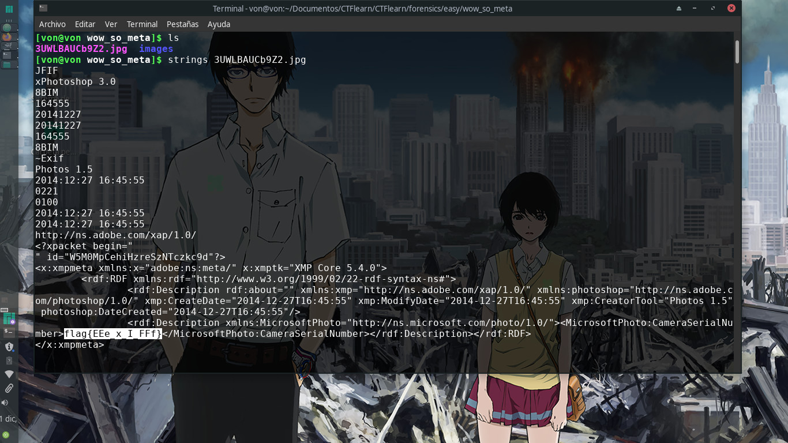

# WOW.... So Meta

## 20 points

### Forensics - Easy

Descripción del reto:

```
This photo was taken by our target. See what you can find out about him from it.
```

### URL del archivo:

```
https://mega.nz/#!ifA2QAwQ!WF-S-MtWHugj8lx1QanGG7V91R-S1ng7dDRSV25iFbk
```

### Solución del reto:
Para este reto sólo se nos brindará una imagen la cual tiene la flag escondida en algún lugar.
Para solucionar el reto habrá que utilizar strings, un comando de linux que retorna cada string
de un archivo, de todas formas te dejaré aquí abajo una descripción breve del comando para que lo conozcas por si no te quedó muy claro:
```
The strings command returns each string of printable characters in files. Its main uses are to determine the contents of and to extract text from binary files (i.e., non-text files).
```
Una vez habiendo utilizado el comando podremos encontrar la flag en la parte inferior dentro de un XML.


