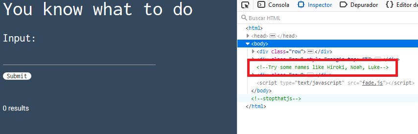
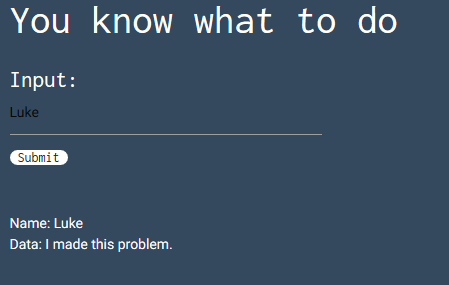

# Basic Injection

## 30 points

### Web - Easy

Descripción del reto:

```
See if you can leak the whole database. The flag is in there somwhere…
```

### URL del reto:

```
https://web.ctflearn.com/web4/
```

### Solución del reto:

Como primer consejo, es importante mencionar que cuando el reto se trata de la categoría web
el primer paso siempre deberá ser inspeccionar la página, por lo que procederemos a inspeccionarla y ver su código ya que en esta categoría suelen haber hay pistas escondidas marcadas como comentarios en el código, aún cuando el título del reto ya nos dice mucho sobre el tipo de reto que es.
Resolvamos el primer reto de inyecciones SQL.



Tal como mencioné anteriormente, se nos brindó una pista en el código.
La primera pista que nos dan es que intentemos consultar algunos nombres como: Hiroki, Noah, Luke.
Después de probarlos todos, notamos que al escribir Luke, la consulta nos arroja un chat.



Para solucionar este reto bastará con hacer una inyección en el input para lograr traer el chat de todos los usuarios y no sólo el de Luke pues fue el único que nos funcionó así que la inyección quedaría de la siguiente forma:

```
Luke' OR '1'='1
```


¿Por qué ocurre esto?
Pondŕe de ejemplo una consulta normal que tiene problemas de seguridad realizada en PHP.
Esta consulta nos traería el chat de una persona en específico y la consulta se vería como:

```
SELECT * FROM users WHERE name = '. $variable .';
```

Siendo . un elemento para concatenar.
En donde $variable es el valor que llegará del input.
Por lo que si inyectamos Luke' OR '1'='1 la consulta final terminaría de la siguiente manera:

SELECT * FROM users where name = 'Luke' OR '1'='1'

Por lo que al cumplir la condición OR '1'='1' nos desplegará todo el chat, y no sólo donde aparece Luke.
