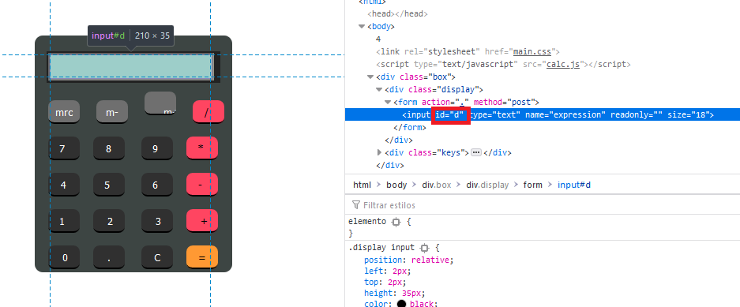

# Calculat3 M3

## 80 points

### Web - Hard

Descripción del reto:

```
I forget how we were doing those calculations, but something tells me it was pretty insecure.
```

### URL del reto:

```
http://web.ctflearn.com/web7/
```

### Solución del reto:

Al entrar al sitio veremos una calculadora.


Al utilizarla y hacer una operación podemos ver que nos imprime el resultado en la misma pantalla.
Desde aquí esto resulta sospechoso pues es un caso muy común de la función "eval" la cual ejecuta
el código directamente como provenga de la entrada.


Procedemos a inspeccionar la página para dar con el archivo javascript de la calculadora y ver como funciona.


Aquí es donde notamos que efectivamente se trata de una vulnerabilidad de tipo "eval", donde el valor de la id "d" corresponde a la sección que muestra la expresión en la calculadora.


Sin embargo, aún sabiendo esto, no podemos ingresar nada que no sean números u operadores,
pero esto se soluciona bastante fácil con algo de javascript básico.



Como ya sabemos su id (también puede ser obtenida al inspeccionar dicho elemento como se ve en la imagen anterior),
sólo bastará con escribir:

```
document.getElementById('d').value = ";ls";
```

Escribiremos ese valor en la calculadora, y al ejecutarlo ejecutará la instrucción ls la cual mostrará los archivos situados en la carpeta trayendo consigo la FLAG.


