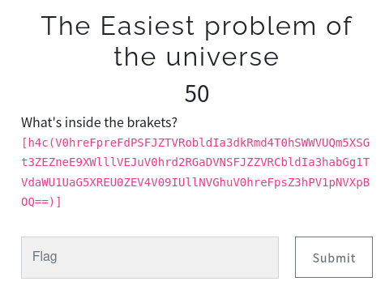
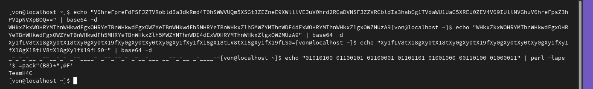

# The Easiest problem of the universe 



Este reto de criptografía fue bastante sencillo. 



Sólo fue necesario decodificar los base64 que se iban generando al decodificar el base64 anterior hasta que 
obtenías lo siguiente: 

```_-_-_-__ _--__-_- _--____- _--_--_- _-__-___ __--_-__ _-____--```

Por mera lógica cambié los _ por 0 y los - por 1 ya que parecía la ausencia y la no ausencia de datos
obteniendo así el siguiente binario: 01010100 01100101 01100001 01101101 01001000 00110100 01000011
y al ver que habían 8 bits por byte sólo bastó con pasarlo a ASCII obteniendo así la flag.


