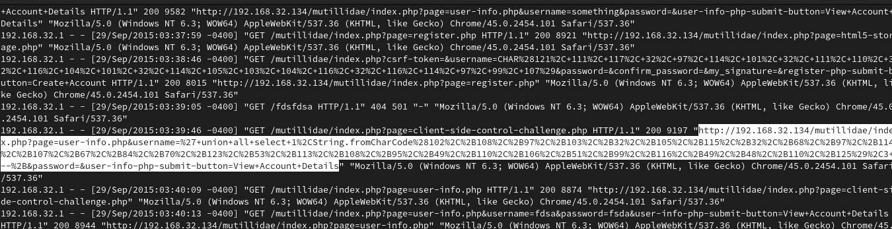

# Apache-logs


En este reto se nos daba un archivo que contenía los logs de un servidor web y se nos pedía que
encontraramos el nombre del ataque con el que se comprometió el servidor.

Después de leer el log pude encontrarme con algo realmente interesante, se trataba de una sql injection.



En este punto lo único que tuve que hacer fue decodificar la URL donde podía verse este ataque para poder entenderlo de forma
más clara resultando en lo siguiente:

```
http://192.168.32.134/mutillidae/index.php?page=user-info.php&username='+union+all+select+1,
String.fromCharCode(102,+108,+97,+103,+32,+105,+115,+32,+68,+97,+114,+107,+67,+84,+70,+123,+53,+113,+108,+95,+49,+110,+106,+51,+99,+116,+49,+48,+110,+125),3+--+&password=&user-info-php-submit-button=View+Account+Details
```

Lo más interesante aquí son los valores ASCII que se presentan así que para decodificarlos hice el siguiente script en python.


De esta forma obtuve la flag.


