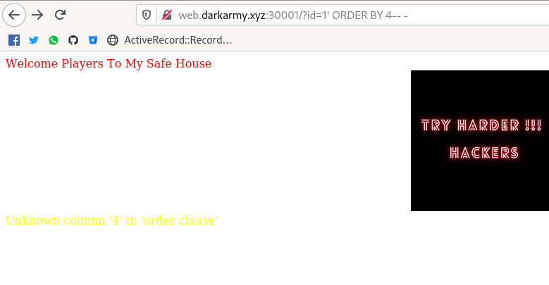
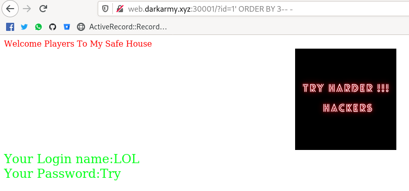
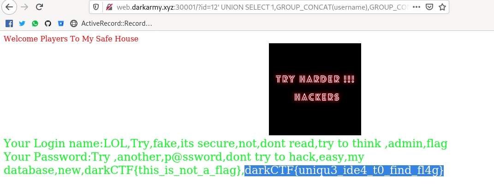

# So-simple

Este reto se parece mucho a Simple-sql. Sólo bastaba con poner el parametro id en la URL para empezar todo así
que omitiré ese paso.

Este reto se basaba en utilizar una sql injection para obtener la información de la base de datos.

El primer paso para mí es siempre hacer que la consulta deje de funcionar, esto se puede lograr con una simple ' o con "
dependiendo el caso. Una vez confirmado esto puedes proceder al siguiente paso, el cual se basa en conocer
el número de columnas que retorna la consulta.

* http://web.darkarmy.xyz:30001/?id=12%27%20ORDER%20BY%203--%20-

Después mediante UNION SELECT puedes poner los datos reemplazando lo que retorna la consulta para saber en donde se imprime 
esta información, yo opté por números porque es más sencillo ubicarlos de esta forma pues puede que si utilizo un string
la columna no pertenezca al mismo tipo de dato.

El siguiente paso era conocer el nombre de las tablas por lo que te dejaré aquí la sql injection que realicé para obtenerlas.

* http://web.darkarmy.xyz:30001/?id=12%27%20UNION%20SELECT%201,2,GROUP_CONCAT(table_name)%20from%20information_schema.tables%20WHERE%20table_schema=database()--%20-

Al final sólo me traje todos los resultados de la tabla gracias al paso anterior y pude observar que la flag se encontraba en uno de los registros de la tabla usuarios siendo este el último registro obteniendo así la flag.

* http://web.darkarmy.xyz:30001/?id=12%27%20UNION%20SELECT%201,GROUP_CONCAT(username),GROUP_CONCAT(password)%20from%20users--%20-

