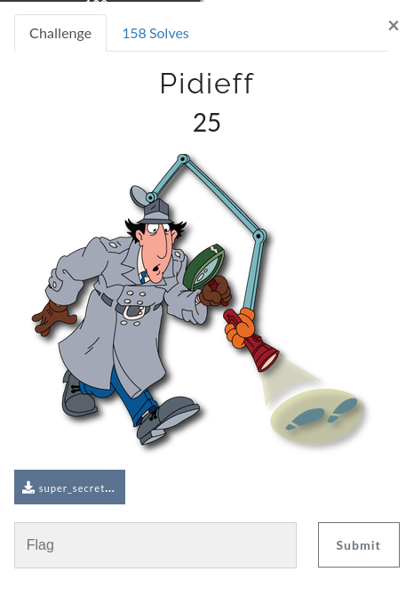
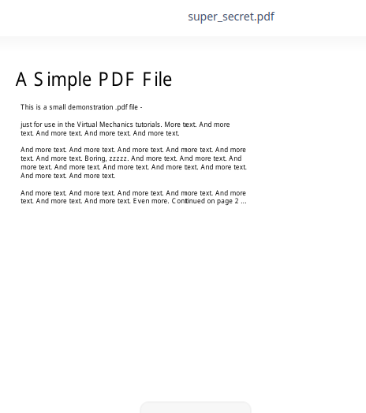
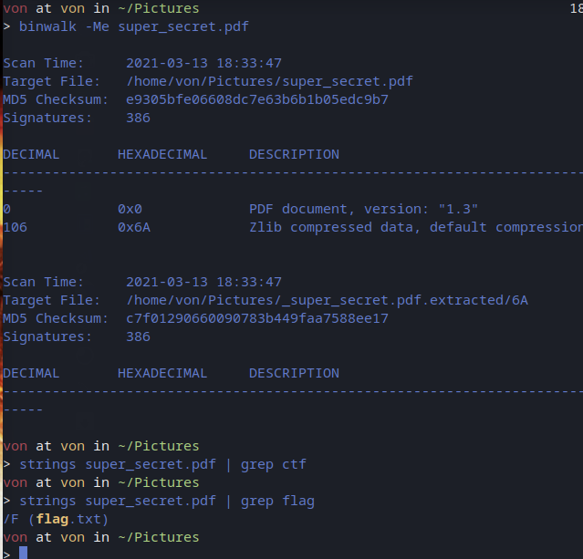
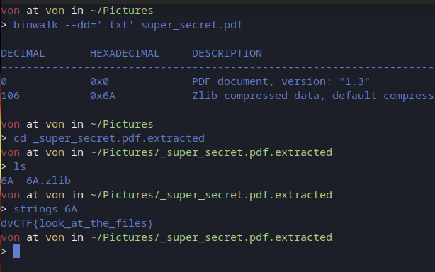

# Read

## Description



## Solution

In this challenge they gave us a PDF.



I tried to search hidden files inside but i had no success...

So i searched the flag inside the PDF using strings and i found something interesting...
There was a flag.txt inside the PDF, the file was hidden and even if i used binwalk it wasn't detected.



I tried again to find the hidden file applying a filter for all the .txt extensions and that's how i got the hidden file and the flag.




```
Remember us, remember that we lived...
```