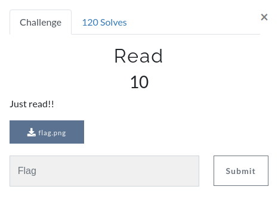
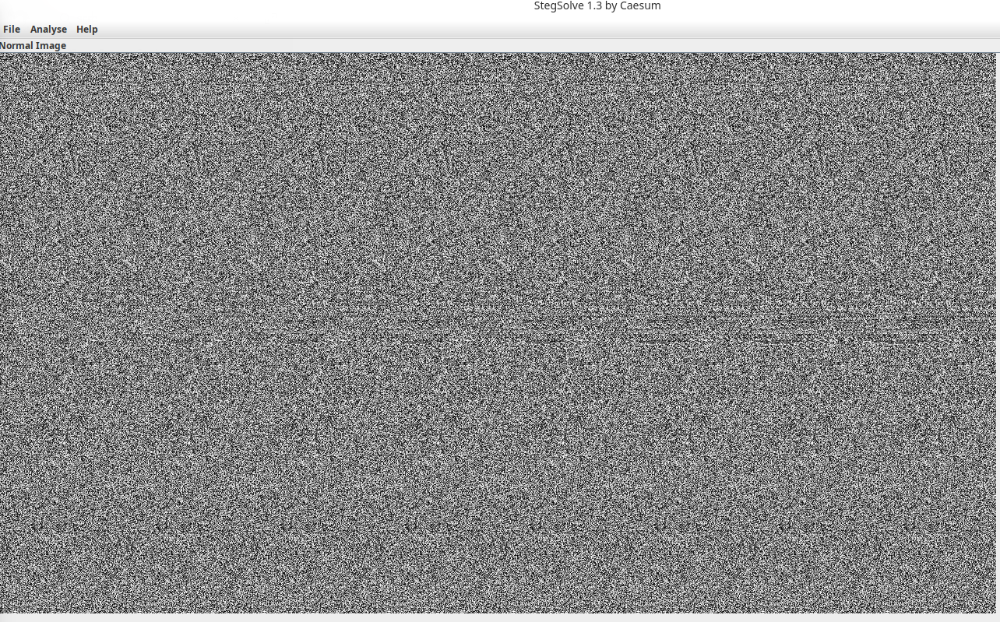
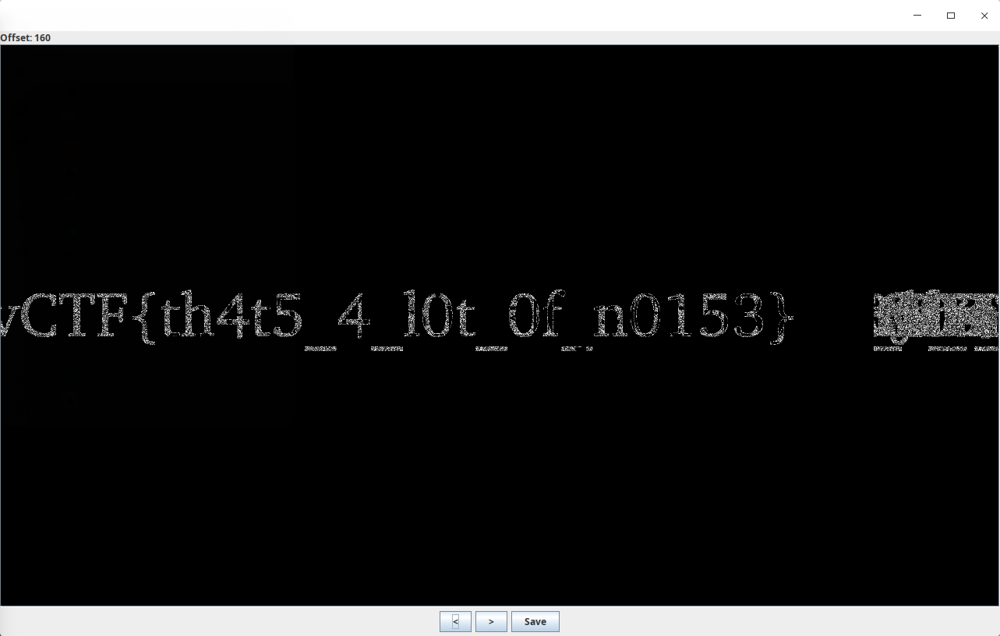

# Read

## Description



## Solution

This was a very simple challenge, judging from the image i guessed that it could have been solved with Stegsolve.



Once i opened the file, i used stegsolve with the stereogram solver and after some tries i got the flag.




```
Remember us, remember that we lived...
```