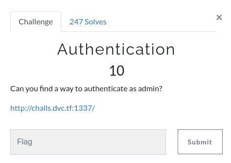
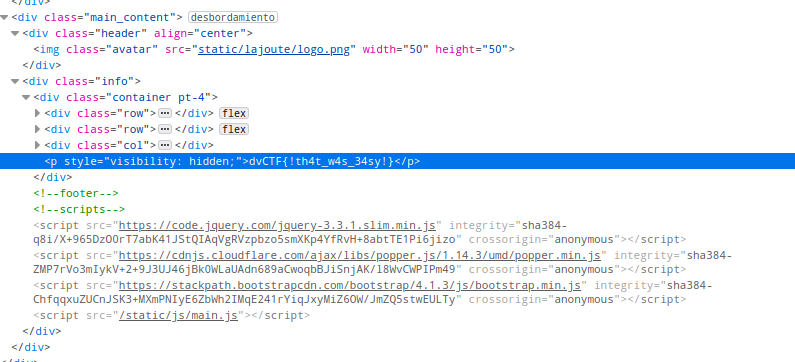

# Authentication

## Description



## Solution

In this challenge, they gave us a page, and there was only a login so i tried to do a basic sql injection and it worked.


Then, i just searched the flag inside the HTML code and that's how i got the flag.





```
Remember us, remember that we lived...
```