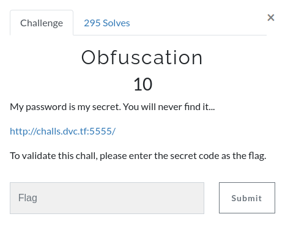
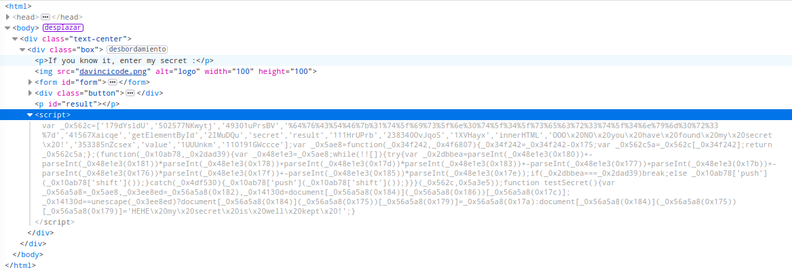
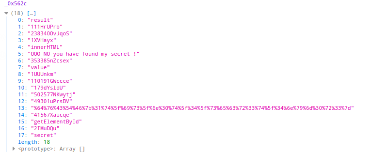
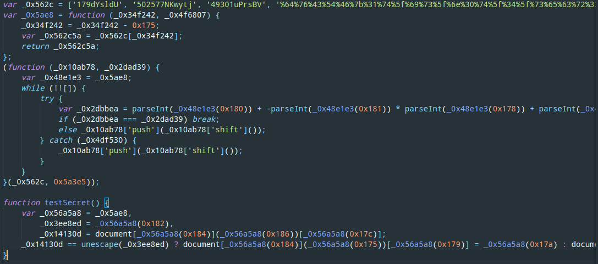
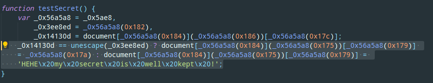
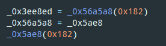
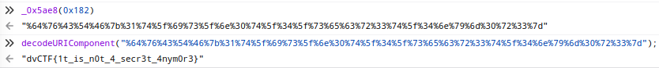

# Obfuscation

## Description



## Solution

In this challenge, they gave us a page, and there was only an input with a send button, so based
in the challenge name and the input i thought that it must be a js obfuscation challenge. So let's check the code.


Obfuscated javascript code.



In order to deobfuscate the code, i used the console to get the array values.



Then i moved to Visual Studio Code and i used the beautify command to make the code more readable.



Here i noticed a comparisson, in one case it does some stuff but in the other case it shows 'HEHE my secret is well kept!' so i guessed that the other value was the right answer so i reversed the code and i got the next function.




Then i just executed the function with the correct value and decoded the result using javascript, that's how i got the flag.



```
Remember us, remember that we lived...
```