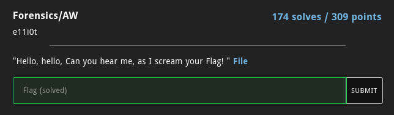
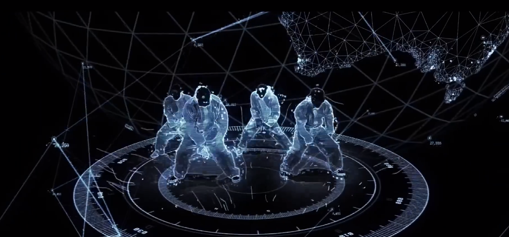
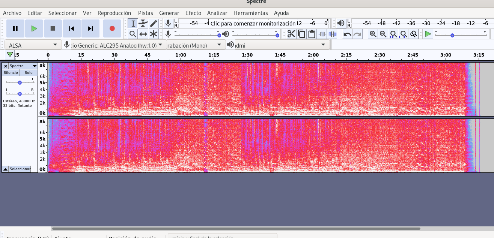

# Aw





En este reto sólo se nos daba un archivo MP4 el cual era un vídeo de artista.

Para solucionarlo fue bastante sencillo, primero convertí el MP4 a WAV para poder usar audacity
y así inspeccionar su espectrograma, algo muy común cuando se trata de analizar archivos de audio en busca
de mensajes ocultos así que utilicé la siguiente instrucción para convertirlo:

```
fmpeg -i Spectre.mp4 Spectre.wav
```

Después abrí audacity e inspeccioné el espectograma del archivo encontrando así la flag.





