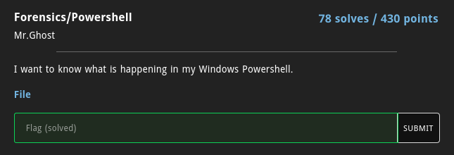
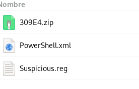

# Powershell




En este reto sólo se nos daba un archivo mp3 el cual estaba corrompido, sin embargo, no le tomé importancia
ni tampoco intenté repararlo, preferí ver si tenía dentro archivos ocultos y tenía razón.
Para lograr esto utilicé la siguiente instrucción recursiva de binwalk.

```
binwalk -Me file.mp3
```




Después estuve buscando en los comandos guardados en el xml si había algo interesante
hasta que me topé con uno que me llamó la atención.


Al final sólo bastó con decodificar el base64 para encontrar la flag.

