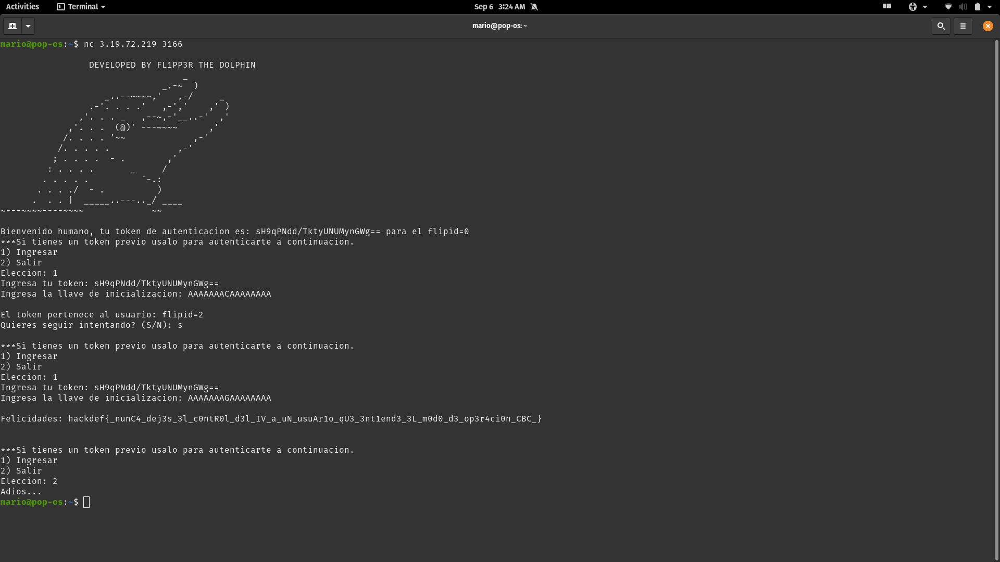

# Flipp3r

### Resuelto por Manjaro

### Descripcion del Reto

Este reto nos da otra ip con un servicio y nos vuelve a dar un script de python.
```nc 3.19.72.219 3166```

Analizando el codigo nos damos cuenta de que es un cifrado AES con modo CBC, y que el servicio nos da un base64 del string
*"flipid="* 0-5 encriptado con una key aleatoria y el iv *"AAAAAAAAAAAAAAAA"*

Para que nos de la flag necesitamos darle un string y un iv que decodificado nos de *"flipid=6"* que es el id del administrador.

```python
import socketserver
import random
import base64
import string
import secrets
import re
from Crypto.Cipher import AES
from Crypto.Util.Padding import pad, unpad

flipper = '''
                 DEVELOPED BY FL1PP3R THE DOLPHIN 
                                   _
                               _.-~  )
                    _..--~~~~,'   ,-/     _
                 .-'. . . .'   ,-','    ,' )
               ,'. . . _   ,--~,-'__..-'  ,'
             ,'. . .  (@)' ---~~~~      ,'
            /. . . . '~~             ,-'
           /. . . . .             ,-'
          ; . . . .  - .        ,'
         : . . . .       _     /
        . . . . .          `-.:
       . . . ./  - .          )
      .  . . |  _____..---.._/ ____ 
~---~~~~----~~~~             ~~

'''

with open("flag.txt") as f:
    flag = f.readline()

def gen_random_key(N):
    return ''.join(secrets.choice(string.ascii_uppercase + string.digits) for _ in range(N))

def delfin_encrypt(iv,key,msg):
    cipher = AES.new(bytes(key,"utf-8"),AES.MODE_CBC,bytes(iv,"utf-8"))
    los_bytes = cipher.encrypt(pad(bytes(msg,"utf-8"),AES.block_size,style="pkcs7"))
    return base64.b64encode(los_bytes)

def delfin_decrypt(iv,key,msg):
    try:
        ciphertext = base64.b64decode(msg)
        cipher = AES.new(bytes(key,"utf-8"),AES.MODE_CBC,iv)
        el_string = unpad(cipher.decrypt(ciphertext),AES.block_size,style="pkcs7")
        return str(el_string,"ascii")
    except:
        return "Padding Incorrecto"

class Dolphin(socketserver.BaseRequestHandler):
    def handle(self):
        key = gen_random_key(16)
        iv = "\x41"*16
        self.request.send(bytes(flipper,"utf-8"))
        mensaje = "flipid=" + str(random.choice(range(100)) % 5)
        opcion = 0
        self.request.send(bytes("Bienvenido humano, tu token de autenticacion es: %s para el %s " % (str(delfin_encrypt(iv,key,mensaje),"utf-8"),mensaje),"utf-8"))
        while True:
            self.request.send(b"\r\n***Si tienes un token previo usalo para autenticarte a continuacion.\r\n1) Ingresar\r\n2) Salir\r\n")
            self.request.send(b"Eleccion: ")
            try:
                opcion = int(self.request.recv(1024).strip())
            except:
                self.request.send(b"ERROR, opcion incorrecta")
                pass
            if opcion == 1:
                while True:
                    self.request.send(b"Ingresa tu token: ")
                    token = self.request.recv(1024).strip()
                    self.request.send(b"Ingresa la llave de inicializacion: ")
                    llave = self.request.recv(1024).strip()
                    if len(llave) < 16:
                        self.request.send(b"\r\nLa llave de inicializacion no cumple con el tamano requerido\r\n")
                    id = delfin_decrypt(llave[:16],key,token)
                    if "flipid=6" in id:
                        self.request.send(b"\r\nFelicidades: %b" % bytes(flag,"utf-8"))
                        self.request.send(b"\r\n")
                        break
                    else:
                        try:
                            self.request.send(b"\r\nEl token pertenece al usuario: %s\r\n" % bytes(id,"utf-8"))
                        except:
                           self.request.send(b"\r\nHay un problema con tu token\\r\n")
                    self.request.send(b"Quieres seguir intentando? (S/N): ")
                    s = str(self.request.recv(1024).strip(),"utf-8")
                    if s is "S":
                        pass
                    elif s is "N":
                        break
                    else:
                        break
            elif opcion == 2:
                self.request.send(b"Adios...")
                break

if __name__ == "__main__":
    HOST, PORT = "0.0.0.0", 3166
    server = socketserver.ThreadingTCPServer((HOST, PORT), Dolphin)
    server.allow_reuse_address = True
    server.serve_forever()
```

### Solucion

Al seguir analizando el problema me di cuenta que no habia que modificar el token, sino el iv,
especificamente en la posicion del numero del id. Despues de un poco de prueba y error:



Nos da la flag ```hackdef{_nunC4_dej3s_3l_c0ntR0l_d3l_IV_a_uN_usuAr1o_qU3_3nt1end3_3L_m0d0_d3_op3r4ci0n_CBC_}```
