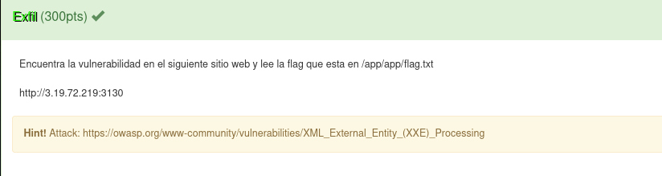

# Exfill

# Resuelto por V̵O̵N̵

## Descripción del reto

Me pareció un reto bastante sencillo, se trataba de un reto del tipo xxe en el que ya sabíamos la ruta de la flag y
sólo debíamos explotar la vulnerabilidad para traernos el contenido del archivo de la ruta.

La página te permitía subir un xml el cual si seguías su estructura cargaría tus contactos de forma más sencilla.
Por lo que realicé un payload para que en lugar de cargar mis contactos cargara el contenido de un archivo dada la ruta especificada
para explotar la vulnerabilidad que mencioné previamente y así obtuve la flag.

