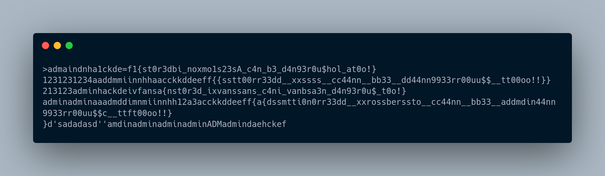

# Fisgón

# Resuelto por V̵O̵N̵

## Descripción del reto

Sin duda alguna fue mi reto favorito de todo el evento, y no sólo por el hecho de cambiar un poco la formula
sino que fue muy divertido ver como había todo tipo de ataques en este reto por parte de los mismos participantes.

De entrada sabía que se trataba de un reto de XSS, sin embargo, este era un stored XSS así que cualquier participante
que entrara a la página iba a ejecutar lo que algún otro participante malicioso realizara y aquí empezó lo divertido.
Había gente reedirigiendo a los demás a sus páginas (quisiera creer que no era para sabotear a los demás pero igual fue divertido).
Otros ejecutando un montón de alerts, otros incluso ya en la noche ponían mensajes como "A dormir chavos ya es tarde :)))))" LMAO...
Fue toda una experiencia, sin embargo, ya es hora de volver al reto.

La página principal te permitía registrarte como alumno, y el usuario de cada alumno se mostraba abajo, por lo que si
registrabas un usuario como: "" este se guardaría en su base de datos
y se ejecutaría cada vez que un usuario entrara y cargara la página.

Hice varios intentos sin éxito cuando empecé el reto, sabía que el administrador entraría cada cierto tiempo a iniciar sesión en la página pero pensé que se trataba más de un reto en el que tenías que robar las cookies del administrador para robarle la sesión
y de esta forma iniciar sesión como él pero esto fue una trampa que me costó bastante tiempo, sin mencionar que había participantes
que estaban saboteando el reto ya que se ponían una cookie falsa con una flag falsa y mi primer payload
consistía en robar las cookies de los usuarios que entraran a la página así que ahí estaba yo intentando ingresar flags falsas
al sistema LOL por lo que perdí un montón de tiempo, sin mencionar a los que te reedirigían a sus páginas para lograr el mismo objetivo (yo opté por usar un fetch para no molestar a los demás con las reedirecciones).

Una vez aclarado esto, mi forma de solucionar el reto fue algo diferente a la de los demás porque me di cuenta tarde que había complicado bastante las cosas. En pocas palabras hice un keylogger con javascript. Cada tecla que se pusiera en esos formularios llegaba a un php en mi hosting que guardaba todo en un txt y aquí hubo de todo... gente escribiendo flags falsas y enviandolas 
en los formularios, otros que usaron sql map y me llenaron mi txt de puras consultas (estos sí fueron molestos porque tiraron el 
reto varias veces), sin embargo, al final cuando ya todos dejaron de escribir pude capturar la flag, misma que se mostrará en la siguiente imagen. 

Me parece que una forma más sencilla de solucionar el reto sin tener que preocuparme por ordenar el texto ni repararlo
hubiese sido sólo capturar el submit del formulario, sin embargo, aún cuando mi solución no fue las más óptima saqué una
medalla por ser el segundo en resolverlo y me divertí bastante aprendiendo algo nuevo.

Aquí dejaré mis scripts del servidor y mi payload por si a alguien le es de utilidad.

