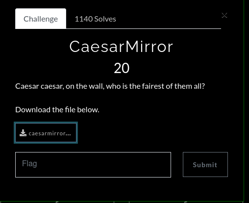
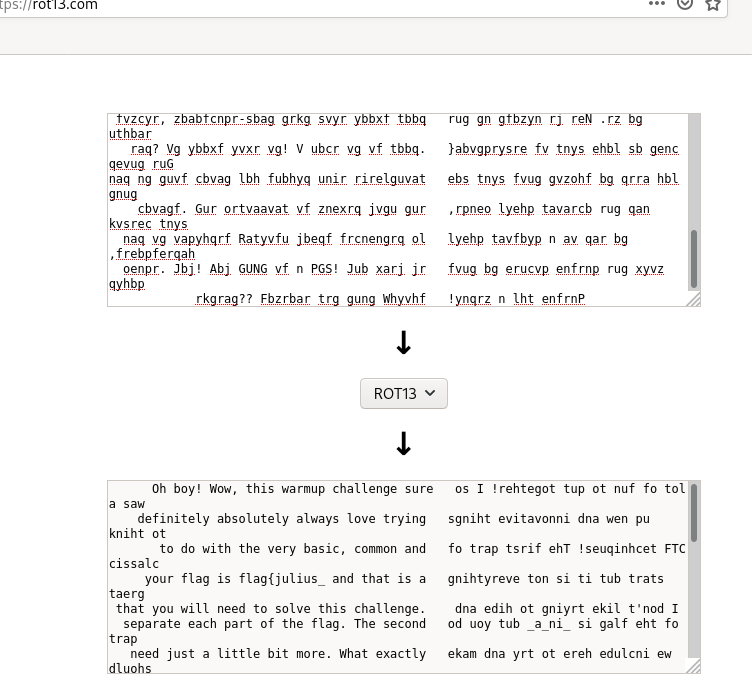

# Caesar Mirror

Simplemente leyendo el nombre del reto supe que se trataba de algo relacionado a criptografía y tomando en cuenta los puntos
que daba el reto imaginé que sería algo básico (no sé mucho de criptografía).
Aquí nos daban un mensaje cifrado por lo que utilicé ROT13 basado en el nombre del reto para ver si podía obtener el mensaje original y así fue.

La otra mitad del texto estaba en modo espejo así que sólo bastaba con voltearlo para obtener el mensaje completo y obtener la flag la cual se encontraba en pedazos por todo el texto.

