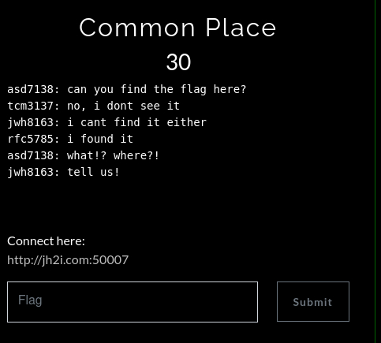

# Common place

Este fue un reto bastante interesante pues de entrada ya suponía de qué trataba, sin embargo, me tomó un tiempo dar con la solución.

Por el puro nombre pude deducir que se trataba de una ruta/archivo/directorio web común, un ejemplo de esto sería el archivo robots.txt pero aún así no logré encontrar el archivo por más que intenté diferentes rutas así que volví a ver la descripción
del reto y noté que el usuario que lo había encontrado tenía un nombre extraño... "rfc5785" por lo que procedí a investigarlo.

Se trataba de .well-know así que no estaba tan perdido, sí era el tema del reto pero tenía que investigar más.
El resto fue muy sencillo, me metí a la url y ahí encontré la verdadera ruta de la flag.

