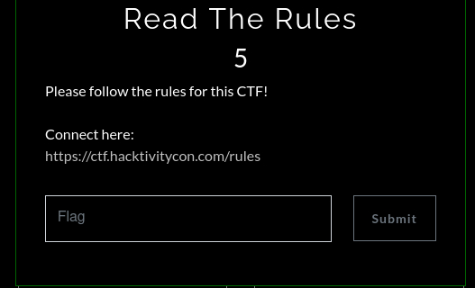
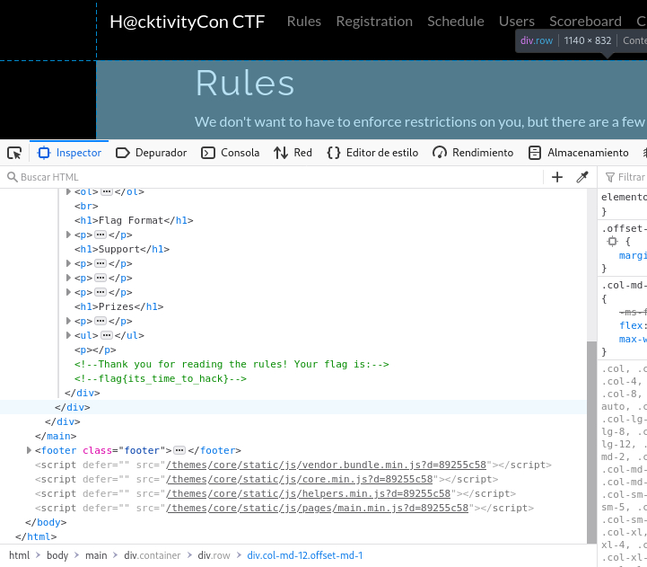

# Read the rules

Este reto me trajo algo de nostalgia pues cuando empecé en los CTFS recuerdo que este tipo de retos siempre me alegraban un montón ya que siempre podía resolverlos, pero en cuanto eran diferentes de este me sentía mal pues sentía que eran imposibles haha. Este es el tipo de reto donde la flag se encuentra en los comentarios del HTML/CSS/JS de la página.

