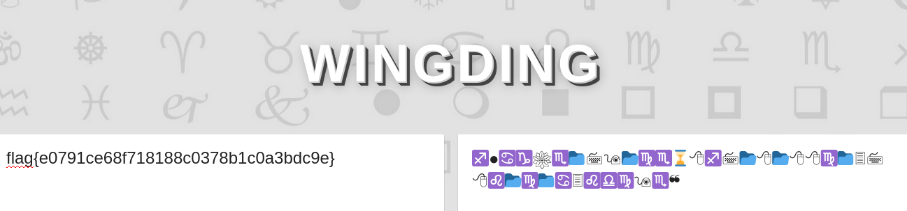

# Chicken Wings

## Description


## Solution

Another challenge from Joe Hammond.

In this challenge they give us a file with this:
♐●♋♑❀♏📁🖮🖲📂♍♏⌛🖰♐🖮📂🖰📂🖰🖰♍📁🗏🖮🖰♌📂♍📁♋🗏♌♎♍🖲♏❝


After some research the flag was made using a special font from Microsoft called Winding.

What is Winding? Winding is a serie of symbols implemented by Microsoft in the 1990s. These symbols were packaged into a font so they could easily be used.



```
Remember us, remember that we lived...
```