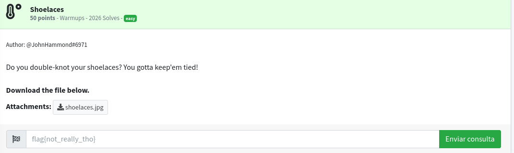
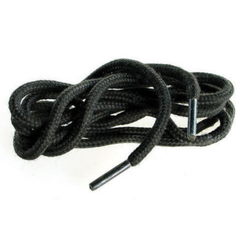
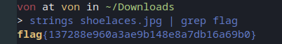

# Shoelaces

## Description

## Solution

Another challenge from Joe Hammond.
In this challenge they give us an image.



As you can see there was nothing suspicious.



But after some basic research the flag was hidden inside as a string.



```
Remember us, remember that we lived...
```