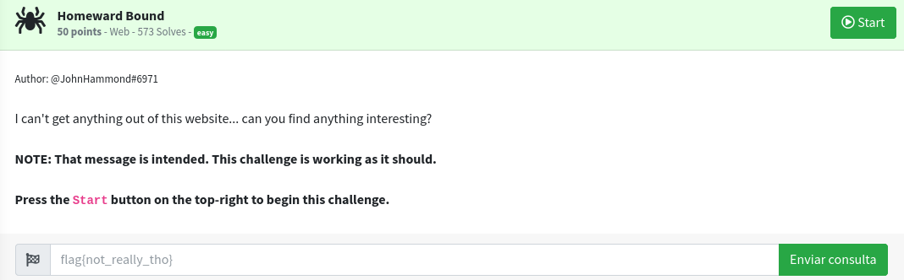
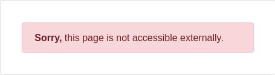
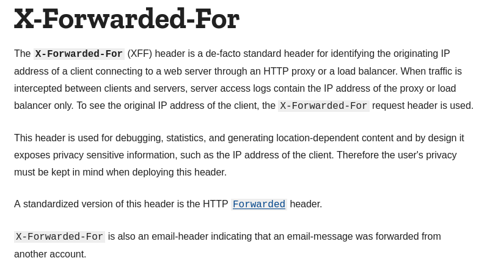
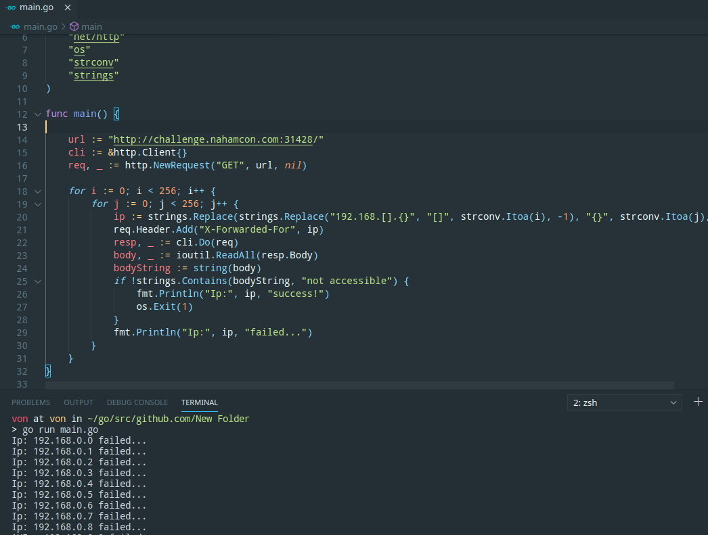
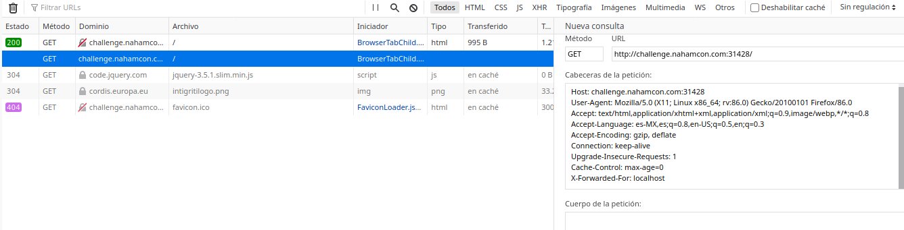
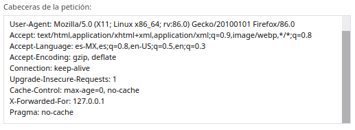
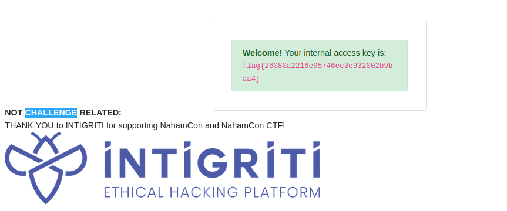

# Homeward Bound

## Description



## Solution

First of all, i want to say that i was very excited when i solved this challenge because it was made by John Hammond,
the guy who teached me all that i know thanks to his youtube channel, thanks for all your amazing content, it was a very interesting challenge
even if it was in the easy category.

In this challenge, they gave us a page, and there was only an error message.



The first thing that i did was to search a way to make a request like i was in the internal network, 
that's how i got with this header.



Then i made requests using differents ips using Golang because there are only a set of private IP addresses which can be used for internal networks but looking how many people solved this challenge i guessed that bruteforce was not the right way...



So, i just tried the easiest way, i used localhost as X-Forwarded-For value but again, i had no success...



And suddenly... i tried 127.0.0.1 and it worked!!!!



That's how i got the flag. 
Thanks again for all the amazing content John.



```
Remember us, remember that we lived...
```