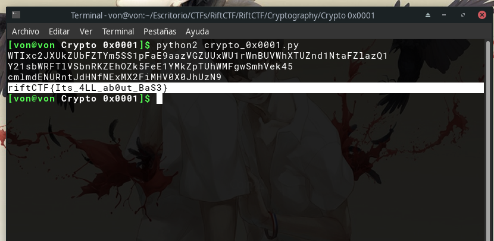

# Crypto 0x0001

## Descripción del reto

```
Do you want to know an insider's secret about crypto? try to decrypt this-
V1RJeGMySlhVa1pVYkZaVFltNVNTMXBGYUU5YWF6VkdaVVV4V1UxclduQlVWV2hYVFVabmQxTnRhRlpsYXpRMQ==
```

## Solución


En este reto nos daban un base64 el cual puede ser identificado facilmente.
Después de decodificarlo me generó nuevamente otro base64 y así sucesivamente
así que para ir más rápido en el caso de que se generaran más base64 
decidí crear un script en python para automatizar la tarea obteniendo
de esta forma la flag.


